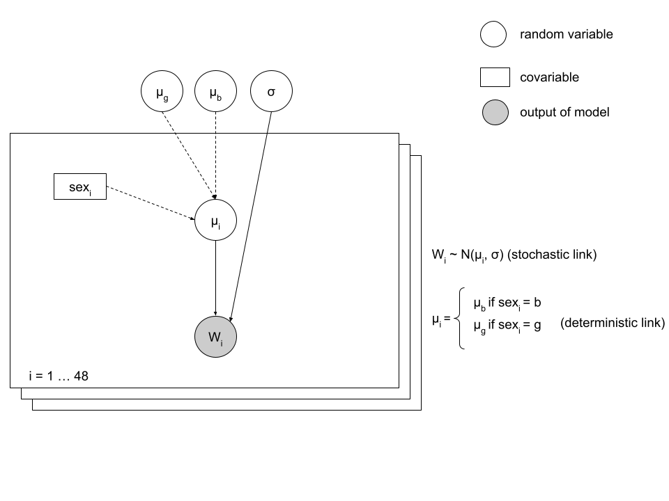

# 1. Context

We wish to compare the birth weight between boys and girls. To do this,
we know the birth weight for a set of 48 children (file pnais48.txt).
Column POIDNAIS represents birth weight, and column SEXE represents sex
(0 : boy, 1 : girl). Variables are renamed as weight and sex. Moreover,
for ease of use, the sex variable is re-encoded by addding 1 at each
child (hence, the value 1 correspond to a boy, and 2 to a girl).

Hypothese: variabilité de poids est le meme chez les filles et les
garcons.

    data_weight <- read.table("pnais48.txt", h = T, sep = ",")
    sex <- data_weight$SEX + 1
    weight <- data_weight$POIDNAIS
    table(sex)

    ## sex
    ##  1  2 
    ## 29 19

The study is on 29 boys and 19 girls.

The weight of children is supposed to follow a normal distribution, with
different means between the two sexes (µb and µg), but a shared standard
deviation (σ). We set two priors: a uniform distribution between 2,500
and 5,000 grams for the mean weight for boys and girls and a uniform
distribution between 200 and 800 grams for the standard deviation of the
weight.

# 2. Model formalization

-   Set up the DAG associated to the model, specifying stochastic and
    deterministic links.

# 3. Implementation of the model

## Model

The model is implemented as a string, called modele1.

-   Beware: In *JAGS*, the normal distribution is parameterized with the
    precision (1/σ2 = τ) and not the standard deviation. The birth
    weight of a child i follows a normal distribution (dnorm), centered
    on mean µi (dependent on sex), and with standard deviation σ (or
    precision τ under *JAGS*). Data is made of N = 48 cases: a loop is
    used to define the distribution followed by each of these
    observations.

-   For ease of use, the mean weights of boys and girls will be stored
    in a vector called means, of length 2. Hence, mean\[1\] will
    correspond to the mean weight of boys, and mean\[2\] to the mean
    weight of girls. For the i th child, mean\[sex\[i\]\] will give the
    mean weight expected for the child. The mean used for the
    distribution associated to each observation depends on the sex :
    mean\[2\] for girls and mean\[1\] for boys. The link between the
    mean used for the distribution associated to an observation and the
    sex is deterministic (simple equality, with no random part).

<!-- -->

    library(rjags)

    ## Loading required package: coda

    ## Linked to JAGS 4.3.0

    ## Loaded modules: basemod,bugs

    model1 <-
      "
      model {
      
      # Defining links
      
      for (i in 1:Nchild)
    {
        mu[i] <- mean[sex[i]]   # mean: vector of two elements, mean for boys                                and means for girls
        w[i] ~ dnorm(mu[i], tau) # weight
    }

      # Definition for a prior distribution  
      mean[1] ~ dunif(2500, 5000) # prior
      mean[2] ~ dunif(2500, 5000)
      tau <- 1/sd # precision
      sd ~ dunif(200, 800)
      }
      "

**~**: stochastic link

**&lt;-**: deterministic link

## Data

-   Define the data required for this model (data). Beware : Do no
    forget to include in the loop the number of observations (N).

<!-- -->

    data_jags <- list(Nchild = length(data_weight$POIDNAIS),
                 sex = sex,
                 w = weight
                 )

## Initial values

Start values need to be in the fixed interval of prior distribution

    init <- list(
      list(mean = c(2600, 2621), sd = 243),
      list(mean = c(4890, 4800), sd = 744),
      list(mean = c(3403, 3534), sd = 538))

## Implementation

    m <- jags.model(file=textConnection(model1),
                    data = data_jags,
                    inits = init,
                    n.chains = 3
                    )

    ## Compiling model graph
    ##    Resolving undeclared variables
    ##    Allocating nodes
    ## Graph information:
    ##    Observed stochastic nodes: 48
    ##    Unobserved stochastic nodes: 3
    ##    Total graph size: 106
    ## 
    ## Initializing model

    update(m, 3000)
    mcmc1 <- coda.samples(m, c("mean", "sd"), n.iter = 5000)

    plot(mcmc1)

    summary(mcmc1)

    ## 
    ## Iterations = 4001:9000
    ## Thinning interval = 1 
    ## Number of chains = 3 
    ## Sample size per chain = 5000 
    ## 
    ## 1. Empirical mean and standard deviation for each variable,
    ##    plus standard error of the mean:
    ## 
    ##           Mean     SD  Naive SE Time-series SE
    ## mean[1] 3728.2 5.2512 0.0428762       0.053951
    ## mean[2] 3379.2 6.5343 0.0533520       0.069084
    ## sd       799.9 0.1053 0.0008601       0.001743
    ## 
    ## 2. Quantiles for each variable:
    ## 
    ##           2.5%    25%    50%  75% 97.5%
    ## mean[1] 3717.9 3724.6 3728.1 3732  3738
    ## mean[2] 3366.2 3374.8 3379.2 3384  3392
    ## sd       799.6  799.9  799.9  800   800
