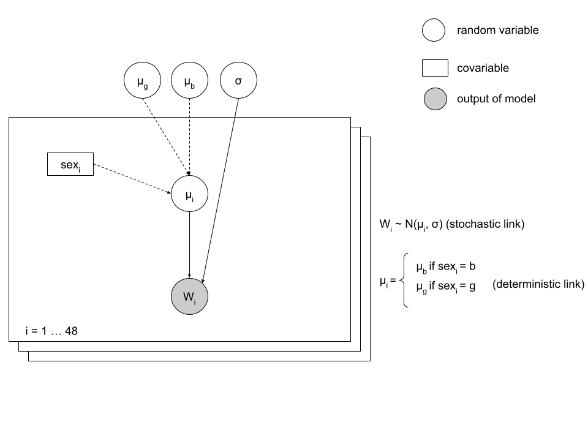
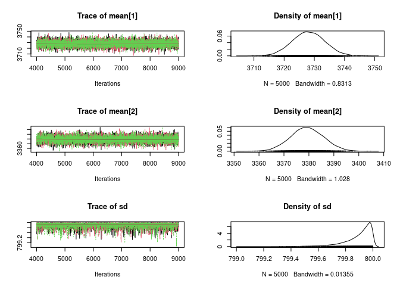
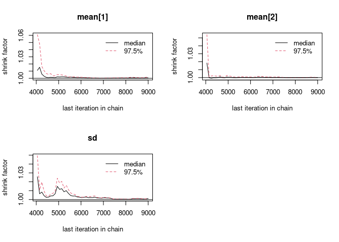

# 1. Context

We wish to compare the birth weight between boys and girls. To do this,
we know the birth weight for a set of 48 children (file pnais48.txt).
Column POIDNAIS represents birth weight, and column SEXE represents sex
(0 : boy, 1 : girl). Variables are renamed as weight and sex. Moreover,
for ease of use, the sex variable is re-encoded by adding 1 at each
child (hence, the value 1 correspond to a boy, and 2 to a girl).

Hypothese: variabilité de poids est le meme chez les filles et les
garcons.

``` r
data_weight <- read.table("pnais48.txt", h = T, sep = ",")
sex <- data_weight$SEX + 1
weight <- data_weight$POIDNAIS
table(sex)
```

    ## sex
    ##  1  2 
    ## 29 19

The study is on 29 boys and 19 girls.

The weight of children is supposed to follow a normal distribution, with
different means between the two sexes (*μ*<sub>*b*</sub> and
*μ*<sub>*g*</sub>), but a shared standard deviation (*σ*). We set two
priors: a uniform distribution between `2500` and `5000` grams for the
mean weight for boys and girls and a uniform distribution between 200
and 800 grams for the standard deviation of the weight.

# 2. Model formalization

-   Set up the DAG associated to the model, specifying stochastic and
    deterministic links.



# 3. Implementation of the model

## Model

The model is implemented as a string, called `desc_model1`.

-   Beware: In ***JAGS***, the normal distribution is parameterized with
    the precision (1/*σ*2 = *τ*) and not the standard deviation. The
    birth weight of a child `i` follows a normal distribution (`dnorm`),
    centered on mean *μ*<sub>*i*</sub> (dependent on sex), and with
    standard deviation *σ* (or precision *τ* under ***JAGS***).  
    Data is made of N = 48 cases: a loop is used to define the
    distribution followed by each of these observations.

-   For ease of use, the mean weights of boys and girls will be stored
    in a vector called `means`, of length 2. Hence, `mean[1]` will
    correspond to the mean weight of boys, and `mean[2]` to the mean
    weight of girls. For the `i` th child, `mean[sex[i]]` will give the
    mean weight expected for the child. The mean used for the
    distribution associated to each observation depends on the sex:
    `mean[2]` for girls and `mean[1]` for boys. The link between the
    mean used for the distribution associated to an observation and the
    sex is deterministic (simple equality, with no random part).

``` r
library(rjags)
```

    ## Le chargement a nécessité le package : coda

    ## Linked to JAGS 4.3.0

    ## Loaded modules: basemod,bugs

``` r
desc_model1 <-
  "
  model {
  
  # Defining links
  
  for (i in 1:Nchild)
{
    mu[i] <- mean[sex[i]]   # mean: vector of two elements, mean for boys                                and means for girls
    w[i] ~ dnorm(mu[i], tau) # weight
}

  # Definition for a prior distribution  
  mean[1] ~ dunif(2500, 5000) 
  mean[2] ~ dunif(2500, 5000)
  tau <- 1/sd # precision
  sd ~ dunif(200, 800)
  }
  "
```

**\~**: stochastic link

**\<-**: deterministic link

## Data

-   Define the data required for this model (data). Beware : Do no
    forget to include in the loop the number of observations (N).

``` r
data_birth_w <- list(Nchild = length(data_weight$POIDNAIS),
             sex = sex,
             w = weight
             )
```

## Initial values

Start values need to be in the fixed interval of prior distribution:

``` r
init_birth_w <- list(
  list(mean = c(2600, 4000), sd = 500),
  list(mean = c(4500, 2700), sd = 700),
  list(mean = c(4000, 4000), sd = 300))
```

## Implementation

``` r
model_birth_w <- jags.model(file=textConnection(desc_model1),
                data = data_birth_w,
                inits = init_birth_w,
                n.chains = 3
                )
```

    ## Compiling model graph
    ##    Resolving undeclared variables
    ##    Allocating nodes
    ## Graph information:
    ##    Observed stochastic nodes: 48
    ##    Unobserved stochastic nodes: 3
    ##    Total graph size: 106
    ## 
    ## Initializing model

``` r
update(model_birth_w, 3000)
mcmc_birth_w <- coda.samples(model_birth_w, c("mean", "sd"), n.iter = 5000)
```

The table of chain `i` is obtained with the following command:

``` r
# mcmc_birth_w[[1]]
```

Each table contains the parameter as columns, with the iterations of the
***MCMC*** as lines.

Computation of the posterior mean of the average birth weight of boys
from the first ***MCMC***:

``` r
mean(mcmc_birth_w[[1]][, "mean[1]"])
```

    ## [1] 3728.292

⇒ On this example, it is not possible to get an explicit description of
the posterior distributions of the parameters. Yet, if *σ* is known,
*μ*<sub>*b*</sub> and *μ*<sub>*g*</sub> both follow a *normal*
distribution. Likewise, if *μ*<sub>*b*</sub> and *μ*<sub>*g*</sub> are
known, *σ* follow as posterior an inverted *gamma* distribution.

But since neither parameter is known, the MCMC algorithm will proceed in
an iterative way. From a starting value (given in `inits` parameter of
the model) for *σ*, values of *μ*<sub>*b*</sub> and *μ*<sub>*g*</sub>
are sampled in the conditional distribution given *σ*. Then a value of
*σ* is sample from its conditional distribution given the generated
values of *μ*<sub>*b*</sub> and *μ*<sub>*g*</sub>. This process is
repeated a large number of times.

This process is a **Gibbs sampling**, which is a specialized case of the
Metropolis algorithm. Gibbs sampling is relevant when the conditional
distributions of the parameters are explicitly given.

# 4. Analysis of convergence and autocorrelation

⇒ Check visually the convergence form the track of the 3 runs of MCMC:

``` r
plot(mcmc_birth_w)
```



Whatever the initial values of the parameters, the three chains seem to
sample in similar ranges. The chains overlap, and mix well. This is a
sign of convergence of the algorithm (convergence towards a
distribution, and not a value).

``` r
gelman.diag(mcmc_birth_w)
```

    ## Potential scale reduction factors:
    ## 
    ##         Point est. Upper C.I.
    ## mean[1]          1          1
    ## mean[2]          1          1
    ## sd               1          1
    ## 
    ## Multivariate psrf
    ## 
    ## 1

``` r
gelman.plot(mcmc_birth_w)
```



The variance reduction index is 1 for the 3 parameters on all the 5000
kept iterations. This index is defined as:

<center>
test
</center>
<center>
$\\sqrt{\\frac{var(total)}{var(wthin-chains)}}$
</center>

It means that
