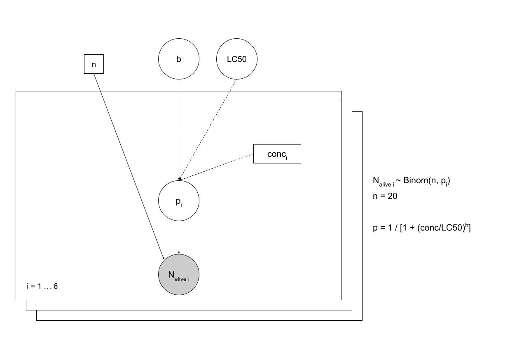
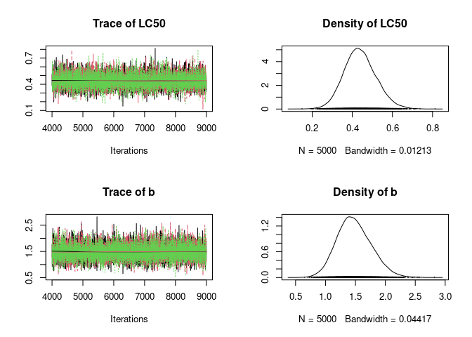
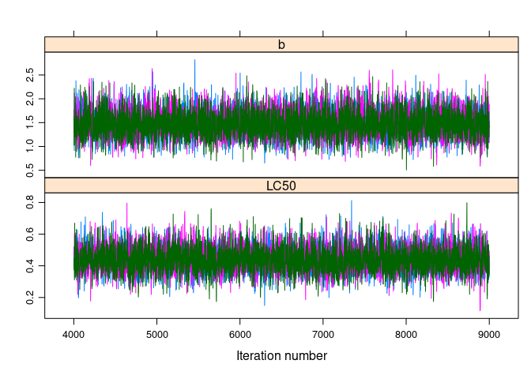
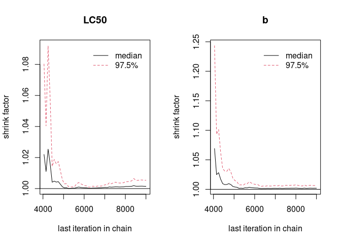
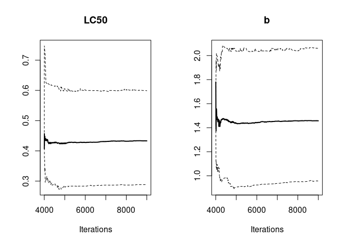
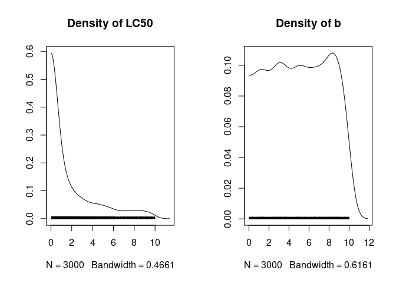
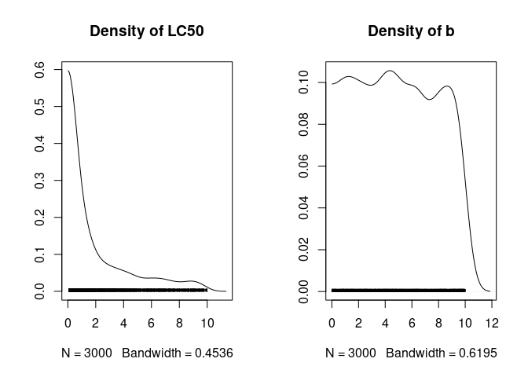

# Example of Bayesian inference on a model in ecotoxicology

Our aim is to study the effect of a toxic substance suspected to pollute
lakes and rivers. We wish to model the effect of this substance on the
death rate of daphnids (small invertebrates of fresh water, called
“water feas”). An in vitro experiment has been conducted to observe the
effect of the pollutant concentration on the death rate of 20 organisms
after an exposition of 21 days. The data for this experiment:

The tested concentrations (µg.ml<sup>-1</sup>): 0.19 0.38 0.76 1.53 3.05
6.11 The number of survivors among the 20 organisms: 16 12 4 3 1 1

We wish to estimate **LC50**, the concentration under which 50% of the
organisms are dead after 21 days, with a log-logistic modeling of the
21-days survival probability, through the formula:


## Model formalization



``` r
library(rjags)
```

    ## Le chargement a nécessité le package : coda

    ## Linked to JAGS 4.3.0

    ## Loaded modules: basemod,bugs

``` r
model1 <-
  "
  model {
  

  for (i in 1:N)
{
    N_alive[i] ~ dbin(p[i], n)
    p[i] <- 1 / (1 + (conc[i]/LC50)^b)
}

b ~ dunif(0, 10)
LC50 <- 10^logLC50
logLC50 ~ dunif(-1,1)

}
  "
```

## Data

``` r
  conc <- c(0.19, 0.38, 0.76, 1.53, 3.05, 6.11)
  N_alive <- c(16, 12, 4, 3, 1, 1)
  N <- 6
  n <- 20

data_jags <- list(
  conc = conc,
  N_alive = N_alive,
  N = N,
  n = n
             )
```

## Initial values

Start values need to be in the fixed interval of prior distribution:

``` r
init <- list(
  list(logLC50 = -0.99, b = 1),
  list(logLC50 = 0, b = 5),
  list(logLC50 = 0.99, b = 9))
```

## Implementation

### Simulations

``` r
m <- jags.model(file=textConnection(model1),
                data = data_jags,
                inits = init,
                n.chains = 3
                )
```

    ## Compiling model graph
    ##    Resolving undeclared variables
    ##    Allocating nodes
    ## Graph information:
    ##    Observed stochastic nodes: 6
    ##    Unobserved stochastic nodes: 2
    ##    Total graph size: 45
    ## 
    ## Initializing model

``` r
update(m, 3000)
mcmc1 <- coda.samples(m, c("LC50", "b"), n.iter = 5000)
```

### Minimal check of convergence

``` r
plot(mcmc1)
```



``` r
require(lattice)
```

    ## Le chargement a nécessité le package : lattice

``` r
xyplot(mcmc1)
```



``` r
summary(mcmc1)
```

    ## 
    ## Iterations = 4001:9000
    ## Thinning interval = 1 
    ## Number of chains = 3 
    ## Sample size per chain = 5000 
    ## 
    ## 1. Empirical mean and standard deviation for each variable,
    ##    plus standard error of the mean:
    ## 
    ##        Mean      SD  Naive SE Time-series SE
    ## LC50 0.4389 0.08015 0.0006544      0.0009351
    ## b    1.4814 0.28516 0.0023283      0.0034123
    ## 
    ## 2. Quantiles for each variable:
    ## 
    ##        2.5%    25%    50%    75%  97.5%
    ## LC50 0.2908 0.3849 0.4351 0.4898 0.6055
    ## b    0.9649 1.2832 1.4642 1.6666 2.0744

``` r
gelman.diag(mcmc1) # return only values of 1 for convergence
```

    ## Potential scale reduction factors:
    ## 
    ##      Point est. Upper C.I.
    ## LC50          1       1.01
    ## b             1       1.01
    ## 
    ## Multivariate psrf
    ## 
    ## 1

``` r
gelman.plot(mcmc1)
```

 \#\#\#
Autocorrelation plot

``` r
autocorr.plot(mcmc1[[1]])
```


``` r
effectiveSize(mcmc1)
```

    ##     LC50        b 
    ## 7368.832 6986.317

``` r
raftery.diag(mcmc1)
```

    ## [[1]]
    ## 
    ## Quantile (q) = 0.025
    ## Accuracy (r) = +/- 0.005
    ## Probability (s) = 0.95 
    ##                                             
    ##       Burn-in  Total Lower bound  Dependence
    ##       (M)      (N)   (Nmin)       factor (I)
    ##  LC50 6        6756  3746         1.80      
    ##  b    5        5483  3746         1.46      
    ## 
    ## 
    ## [[2]]
    ## 
    ## Quantile (q) = 0.025
    ## Accuracy (r) = +/- 0.005
    ## Probability (s) = 0.95 
    ##                                             
    ##       Burn-in  Total Lower bound  Dependence
    ##       (M)      (N)   (Nmin)       factor (I)
    ##  LC50 7        7397  3746         1.97      
    ##  b    6        6295  3746         1.68      
    ## 
    ## 
    ## [[3]]
    ## 
    ## Quantile (q) = 0.025
    ## Accuracy (r) = +/- 0.005
    ## Probability (s) = 0.95 
    ##                                             
    ##       Burn-in  Total Lower bound  Dependence
    ##       (M)      (N)   (Nmin)       factor (I)
    ##  LC50 10       12182 3746         3.25      
    ##  b    6        6406  3746         1.71

## Evolution of MCMC quantiles over iterates

``` r
cumuplot(mcmc1[[1]])
```



### Simulations without observed data (Monte Carlo)

``` r
d0 <- list(conc = conc, n = n, N = N)
m0 <- jags.model(file = textConnection(model1), data = d0, n.chains = 1)
```

    ## Compiling model graph
    ##    Resolving undeclared variables
    ##    Allocating nodes
    ## Graph information:
    ##    Observed stochastic nodes: 0
    ##    Unobserved stochastic nodes: 8
    ##    Total graph size: 45
    ## 
    ## Initializing model

``` r
update(m0, 3000)
mc0 <- coda.samples(m0, c("b","LC50"), n.iter = 3000)
```

## Description of prior and posterior marginal distributions

It is a raw and easy-to-get representation, but poorly suited to uniform
distributions (e.g. b prior) which would be better represented using the
theoretical density rather than using the kernel density estimation from
a sample.

``` r
## Plot of prior densities
plot(mc0, trace = FALSE, density = TRUE)
```



``` r
summary(mc0)
```

    ## 
    ## Iterations = 3001:6000
    ## Thinning interval = 1 
    ## Number of chains = 1 
    ## Sample size per chain = 3000 
    ## 
    ## 1. Empirical mean and standard deviation for each variable,
    ##    plus standard error of the mean:
    ## 
    ##       Mean    SD Naive SE Time-series SE
    ## LC50 2.186 2.534  0.04627        0.04627
    ## b    5.080 2.883  0.05263        0.05263
    ## 
    ## 2. Quantiles for each variable:
    ## 
    ##        2.5%    25%   50%   75% 97.5%
    ## LC50 0.1119 0.3217 1.012 3.244 8.977
    ## b    0.2556 2.6238 5.080 7.632 9.741

``` r
## Plot of posterior densities
plot(mcmc1, trace = FALSE, density = TRUE)
```



``` r
summary(mcmc1)
```

    ## 
    ## Iterations = 4001:9000
    ## Thinning interval = 1 
    ## Number of chains = 3 
    ## Sample size per chain = 5000 
    ## 
    ## 1. Empirical mean and standard deviation for each variable,
    ##    plus standard error of the mean:
    ## 
    ##        Mean      SD  Naive SE Time-series SE
    ## LC50 0.4389 0.08015 0.0006544      0.0009351
    ## b    1.4814 0.28516 0.0023283      0.0034123
    ## 
    ## 2. Quantiles for each variable:
    ## 
    ##        2.5%    25%    50%    75%  97.5%
    ## LC50 0.2908 0.3849 0.4351 0.4898 0.6055
    ## b    0.9649 1.2832 1.4642 1.6666 2.0744

## Joint posterior probability

``` r
mctot <- as.data.frame(as.matrix(mcmc1))
mcsample <- mctot[sample.int(nrow(mctot), size = 500), ]
## Plot of the joint posterior distribution as a scatter plot
pairs(mcsample)
```


``` r
b <- mctot[, "b"]
LC50 <- mctot[, "LC50"]

p <- 1/(1+(1.53/LC50)^b) # mediane et intervalle
```

## Confrontation of the model to the data - posterior predictive check

``` r
summary(mcsample)
```

    ##       LC50              b         
    ##  Min.   :0.1740   Min.   :0.6925  
    ##  1st Qu.:0.3857   1st Qu.:1.3047  
    ##  Median :0.4400   Median :1.4802  
    ##  Mean   :0.4438   Mean   :1.4809  
    ##  3rd Qu.:0.5000   3rd Qu.:1.6583  
    ##  Max.   :0.7416   Max.   :2.5227

``` r
dic.samples(m, n.iter = 5000, type = "pD")
```

    ## Mean deviance:  20.4 
    ## penalty 2.067 
    ## Penalized deviance: 22.47
