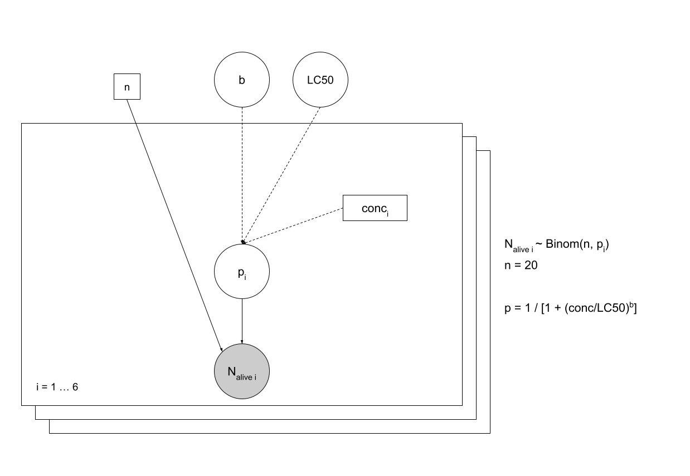

```{r setup, include=FALSE}
knitr::opts_chunk$set(echo = TRUE)
```

# Example of Bayesian inference on a model in ecotoxicology

## Context

Our aim is to study the effect of a toxic substance suspected to pollute lakes and rivers. We wish to model the effect of this substance on the death rate of daphnids (small invertebrates of fresh water, called "water feas").
An in vitro experiment has been conducted to observe the effect of the pollutant concentration on the death rate of 20 organisms after an exposition of 21 days.
The data for this experiment:

The tested concentrations (µg.ml<sup>-1</sup>): 0.19 0.38 0.76 1.53 3.05 6.11
The number of survivors among the 20 organisms: 16 12 4 3 1 1

We wish to estimate **LC50**, the concentration under which 50% of the organisms are dead after 21 days, with a
log-logistic modeling of the 21-days survival probability, through the formula:
$p  = \frac{1}{1+(\frac{conc}{LC50})^b}$

## Data

```{r}
conc <- c(0.19, 0.38, 0.76, 1.53, 3.05, 6.11)
Nalive <- c(16, 12, 4, 3, 1, 1)
n <- 20 # number of organisms
  
plot(Nalive ~ conc, pch = 16, xlab = "concentration of toxic substance", ylab = "number of survivors")
```

## Implementation

### Model formalization



```{r}
library(rjags)

desc_model <-
  "
  model {
  

  for (i in 1:N)
{
    Nalive[i] ~ dbin(p[i], n)
    p[i] <- 1 / (1 + (conc[i]/LC50)^b)
}

b ~ dunif(0, 10)
LC50 <- 10^logLC50
logLC50 ~ dunif(-1,1)

}
  "
```

## MCMC Simulation

### Data

```{r}
data_jags <- list(
  conc = conc,
  Nalive = Nalive,
  N = length(conc),
  n = n
)
```

### Initial values

Start values need to be in the fixed interval of prior distribution:

```{r}
init <- list(
  list(logLC50 = -0.99, b = 1),
  list(logLC50 = 0, b = 5),
  list(logLC50 = 0.99, b = 9))
```

### Simulations of Markov chains

```{r}
model <- jags.model(file=textConnection(desc_model),
                data = data_jags,
                inits = init,
                n.chains = 3
                )

update(model, 3000) # burn-in phase
mcmc1 <- coda.samples(model, c("LC50", "b"), n.iter = 5000)
```

### Minimal check of convergence

```{r include=FALSE}
mcmc1[1]
```

```{r}
plot(mcmc1)

require(lattice)
xyplot(mcmc1)

```

```{r}
gelman.diag(mcmc1) # return only values of 1 for adequate convergence 
gelman.plot(mcmc1)

```

```{r}
geweke.diag(mcmc1)
```
#### Evolution of MCMC quantiles over iterates

```{r}
cumuplot(mcmc1)
```


### Autocorrelation plot

```{r}
acfplot(mcmc1)
autocorr.plot(mcmc1)

effectiveSize(mcmc1) # estimation of effective size in function of autocorrelation for the 3 chains (3 x 5000 = 15000 iterations)

# if we want reduce as possible autocorrelation, we can set the parameter thin = 15000/7000 (7000 => effective size)

raftery.diag(mcmc1)
# if the dependance factor is grater than 5, it means that a strong autocorrelation is present in the chains
```

#### New simulation with adequate _n.iter_ and _thin_ values

* _n.iter_: 10000 iterations (see _raftery.diag_ results);
* _thin_: 2 (see _effectiveSize_ results)

```{r}
# new simulations
mcmc1 <- coda.samples(model, c("LC50", "b"), n.iter = 10000, thin = 2)

# new autocorrelation test
acfplot(mcmc1)
autocorr.plot(mcmc1) 
```

```{r}
xyplot(mcmc1)
```

### Parallelization of MCMC chains

Here, the parallelization is not necessary, but it is interesting when **MCMC** require a huge number of iterations.

#### No-parallel version
```{r}
# t1 <- Sys.time()
# model2 <- jags.model(
#   file = textConnection(desc_model),
#   data = data_jags, 
#   inits = init, 
#   n.chains = 3)
# 
# update(model, 5000)
# 
# mcmc <- coda.samples(model2, c("LC50", "b"), n.iter = 200000, thin = 40)
# t2 <- Sys.time()
```

```{r}
# # computational time
# t2 - t1
```

#### Parallel version

```{r}
# library(dclone)
# # cl <- makePSOCKcluster(3)
# # sous linux ou MAC ce sera plus efficace d utiliser makeForkCluster
# cl <- makeForkCluster(3)
# t1 <- Sys.time()
# 
# parJagsModel(
#   cl, 
#   name = "modelpar", 
#   file = "desc_model.txt",
#   data = data_jags, 
#   inits = init, 
#   n.chains = 3)
# 
# parUpdate(cl, object = "modelpar", n.iter = 5000)
# mcmcpar <- parCodaSamples(cl, model = "modelpar",
# variable.names = c("LC50", "b"),
# n.iter = 200000, thin = 40)
# t2 <- Sys.time()
# stopCluster(cl)
```

## Mcmc utilisation

### Description of posterior marginal distribution

```{r}
summary(mcmc1)

densityplot(mcmc1)
```

```{r}
HPDinterval(mcmc1)
```

### Description of posterior join distribution

```{r}
crosscorr(mcmc1)

crosscorr.plot(mcmc1)
```

```{r}
mctot <- as.data.frame(as.matrix(mcmc1))
mctotsample <- mctot[sample.int(nrow(mctot), size = 300), ]
## Plot of the joint posterior distribution as a scatter plot
pairs(mctotsample)
```

```{r}
require(IDPmisc)
ipairs(mctotsample)
```

```{r}
panel.hist <- function(x, col.hist = "grey", ...)
{
usr <- par("usr"); on.exit(par(usr))
par(usr = c(usr[1:2], 0, 1.5) )
h <- hist(x, plot = FALSE)
breaks <- h$breaks; nB <- length(breaks)
y <- h$counts; y <- y/max(y)
rect(breaks[-nB], 0, breaks[-1], y, col=col.hist, ...)
}
panel.dens <- function(x, col.dens = "red", lwd.dens = 2, ...)
{
usr <- par("usr"); on.exit(par(usr))
par(usr = c(usr[1:2], 0, 1.5) )
densx <- density(x)
vx <- densx$x
vy <- densx$y
lines(vx,vy/max(vy),col=col.dens,lwd=lwd.dens, ...)
}
panel.cor <- function(x, y, digits=2, prefix="", cex.cor, ...)
{
usr <- par("usr"); on.exit(par(usr))
par(usr = c(0, 1, 0, 1))
r <- abs(cor(x, y,method="spearman"))
txt <- format(c(r, 0.123456789), digits=digits)[1]
txt <- paste(prefix, txt, sep="")
if(missing(cex.cor)) cex.cor <- 0.8/strwidth(txt)
#text(0.5, 0.5, txt, cex = cex.cor * r)
text(0.5, 0.5, txt, cex = cex.cor * 0.5, ...)
}
panel.xy <- function(x, y, pch.xy = 1, col.xy = "black", cex.xy = 0.5, ...)
{
points(x,y,pch=pch.xy, col=col.xy,cex=cex.xy, ...)
}
```

```{r}
pairs(
  mctotsample, 
  upper.panel = panel.xy,
  diag.panel = panel.dens,
  lower.panel = panel.cor)
```

```{r}
pairs(mctotsample, upper.panel = panel.xy,
diag.panel = panel.hist,
lower.panel = panel.cor,
col.hist = "blue", pch.xy = 1, col.xy = "red", cex.xy = 1)
```

```{r}
require(GGally)
ggscatmat(mctotsample)
```

### Comparaison between _prior_ and _posterior_ laws

#### Simulations without observed data (Monte Carlo)

```{r}
d0 <- list(conc = conc, n = n, N = length(conc))
model0 <- jags.model(file = textConnection(desc_model), data = d0, n.chains = 1)

update(model0, 5000)
mcmc0 <- coda.samples(model0, c("b","LC50"), n.iter = 5000)
mcmctot0 <- as.data.frame(as.matrix(mcmc0))

par(mfrow = c(1, 3))
par(mar = c(5, 2, 1, 1))
for (i in 1:ncol(mcmctot0))
{
hist(mctot[,i], main = "", xlab = names(mcmctot0)[i], freq = FALSE)
lines(density(mcmctot0[,i]), col = "blue", lwd = 2)
}
```

### Using _posterior_ distribution to estimate parameter

```{r}
b <- mctot[, "b"]
LC50 <- mctot[, "LC50"]

var_conc <- 1.53  # ug/ml
p <- 1/(1+(var_conc/LC50)^b)
quantile(p, probs = c(0.025, 0.5, 0.975))

N_alive <- rbinom(n=length(p),
                  size=20,
                  prob=p)
quantile(N_alive, probs = c(0.025, 0.5, 0.975))
```


## Model validation

### DIC

```{r}
dic.samples(model, n.iter = 5000, type = "pD")
```

### WAIC

```{r}
desc_model_loo <-
  desc_model <-
  "
  model {
  

  for (i in 1:N)
{
    Nalive[i] ~ dbin(p[i], n)
    p[i] <- 1 / (1 + (conc[i]/LC50)^b)
    
    loglik[i] <- log(dpois(p[i], Nalive[i]))
}

b ~ dunif(0, 10)
LC50 <- 10^logLC50
logLC50 ~ dunif(-1,1)

}
  "

```

```{r}
# model_loo <- jags.model(file = textConnection(desc_model_loo), data = data_jags,
# inits = init, n.chains = 3)
# 
# update(model_loo, 5000)
# mcmc_loo <- coda.samples(model_loo, c("loglik"), n.iter = 5000)
# loglik_loo <- as.matrix(mcmc_loo)
```

