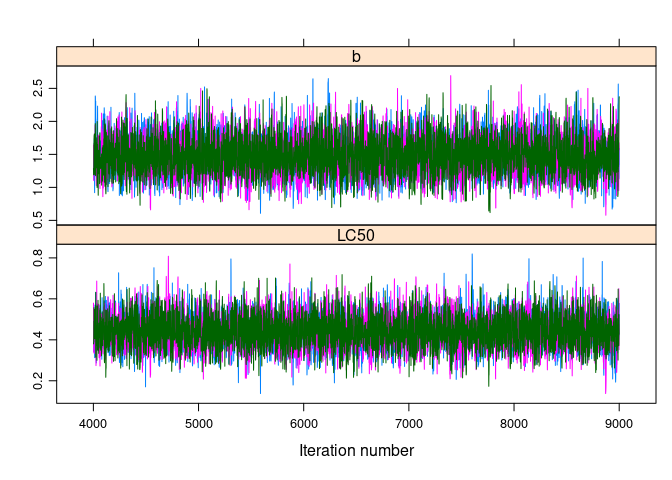
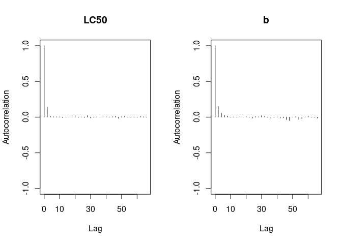
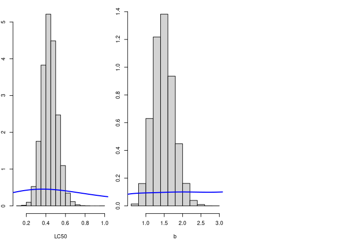

# Example of Bayesian inference on a model in ecotoxicology

## Context

Our aim is to study the effect of a toxic substance suspected to pollute
lakes and rivers. We wish to model the effect of this substance on the
death rate of daphnids (small invertebrates of fresh water, called
“water feas”). An in vitro experiment has been conducted to observe the
effect of the pollutant concentration on the death rate of 20 organisms
after an exposition of 21 days. The data for this experiment:

The tested concentrations (µg.ml-1): 0.19 0.38 0.76 1.53 3.05
6.11 The number of survivors among the 20 organisms: 16 12 4 3 1 1

We wish to estimate **LC50**, the concentration under which 50% of the
organisms are dead after 21 days, with a log-logistic modeling of the
21-days survival probability, through the formula:
$p = \\frac{1}{1+(\\frac{conc}{LC50})^b}$

## Data

    conc <- c(0.19, 0.38, 0.76, 1.53, 3.05, 6.11)
    Nalive <- c(16, 12, 4, 3, 1, 1)
    n <- 20 # number of organisms
      
    plot(Nalive ~ conc, pch = 16, xlab = "concentration of toxic substance", ylab = "number of survivors")

## Implementation

### Model formalization

    library(rjags)

    ## Le chargement a nécessité le package : coda

    ## Linked to JAGS 4.3.0

    ## Loaded modules: basemod,bugs

    desc_model <-
      "
      model {
      

      for (i in 1:N)
    {
        Nalive[i] ~ dbin(p[i], n)
        p[i] <- 1 / (1 + (conc[i]/LC50)^b)
    }

    b ~ dunif(0, 10)
    LC50 <- 10^logLC50
    logLC50 ~ dunif(-1,1)

    }
      "

## MCMC Simulation

### Data

    data_jags <- list(
      conc = conc,
      Nalive = Nalive,
      N = length(conc),
      n = n
    )

### Initial values

Start values need to be in the fixed interval of prior distribution:

    init <- list(
      list(logLC50 = -0.99, b = 1),
      list(logLC50 = 0, b = 5),
      list(logLC50 = 0.99, b = 9))

### Simulations of Markov chains

    model <- jags.model(file=textConnection(desc_model),
                    data = data_jags,
                    inits = init,
                    n.chains = 3
                    )

    ## Compiling model graph
    ##    Resolving undeclared variables
    ##    Allocating nodes
    ## Graph information:
    ##    Observed stochastic nodes: 6
    ##    Unobserved stochastic nodes: 2
    ##    Total graph size: 45
    ## 
    ## Initializing model

    update(model, 3000) # burn-in phase
    mcmc1 <- coda.samples(model, c("LC50", "b"), n.iter = 5000)

### Minimal check of convergence

    plot(mcmc1)

    require(lattice)

    ## Le chargement a nécessité le package : lattice

    xyplot(mcmc1)

    gelman.diag(mcmc1) # return only values of 1 for adequate convergence 

    ## Potential scale reduction factors:
    ## 
    ##      Point est. Upper C.I.
    ## LC50          1          1
    ## b             1          1
    ## 
    ## Multivariate psrf
    ## 
    ## 1

    gelman.plot(mcmc1)

    geweke.diag(mcmc1)

    ## [[1]]
    ## 
    ## Fraction in 1st window = 0.1
    ## Fraction in 2nd window = 0.5 
    ## 
    ##  LC50     b 
    ## 1.333 1.573 
    ## 
    ## 
    ## [[2]]
    ## 
    ## Fraction in 1st window = 0.1
    ## Fraction in 2nd window = 0.5 
    ## 
    ##   LC50      b 
    ## 0.2085 0.4132 
    ## 
    ## 
    ## [[3]]
    ## 
    ## Fraction in 1st window = 0.1
    ## Fraction in 2nd window = 0.5 
    ## 
    ##    LC50       b 
    ##  0.1412 -1.6372

#### Evolution of MCMC quantiles over iterates

    cumuplot(mcmc1)

### Autocorrelation plot

    acfplot(mcmc1)

    autocorr.plot(mcmc1)

    effectiveSize(mcmc1) # estimation of effective size in function of autocorrelation for the 3 chains (3 x 5000 = 15000 iterations)

    ##     LC50        b 
    ## 7584.401 6455.184

    # if we want reduce as possible autocorrelation, we can set the parameter thin = 15000/7000 (7000 => effective size)

    raftery.diag(mcmc1)

    ## [[1]]
    ## 
    ## Quantile (q) = 0.025
    ## Accuracy (r) = +/- 0.005
    ## Probability (s) = 0.95 
    ##                                             
    ##       Burn-in  Total Lower bound  Dependence
    ##       (M)      (N)   (Nmin)       factor (I)
    ##  LC50 7        8120  3746         2.17      
    ##  b    6        6295  3746         1.68      
    ## 
    ## 
    ## [[2]]
    ## 
    ## Quantile (q) = 0.025
    ## Accuracy (r) = +/- 0.005
    ## Probability (s) = 0.95 
    ##                                             
    ##       Burn-in  Total Lower bound  Dependence
    ##       (M)      (N)   (Nmin)       factor (I)
    ##  LC50 7        7675  3746         2.05      
    ##  b    8        9538  3746         2.55      
    ## 
    ## 
    ## [[3]]
    ## 
    ## Quantile (q) = 0.025
    ## Accuracy (r) = +/- 0.005
    ## Probability (s) = 0.95 
    ##                                             
    ##       Burn-in  Total Lower bound  Dependence
    ##       (M)      (N)   (Nmin)       factor (I)
    ##  LC50 7        8120  3746         2.17      
    ##  b    6        7003  3746         1.87

    # if the dependance factor is grater than 5, it means that a strong autocorrelation is present in the chains

#### New simulation with adequate *n.iter* and *thin* values

-   *n.iter*: 10000 iterations (see *raftery.diag* results);
-   *thin*: 2 (see *effectiveSize* results)

<!-- -->

    # new simulations
    mcmc1 <- coda.samples(model, c("LC50", "b"), n.iter = 10000, thin = 2)

    # new autocorrelation test
    acfplot(mcmc1)

    autocorr.plot(mcmc1) 

    xyplot(mcmc1)

### Parallelization of MCMC chains

Here, the parallelization is not necessary, but it is interesting when
**MCMC** require a huge number of iterations.

#### No-parallel version

    # t1 <- Sys.time()
    # model2 <- jags.model(
    #   file = textConnection(desc_model),
    #   data = data_jags, 
    #   inits = init, 
    #   n.chains = 3)
    # 
    # update(model, 5000)
    # 
    # mcmc <- coda.samples(model2, c("LC50", "b"), n.iter = 200000, thin = 40)
    # t2 <- Sys.time()

    # # computational time
    # t2 - t1

#### Parallel version

    # library(dclone)
    # # cl <- makePSOCKcluster(3)
    # # sous linux ou MAC ce sera plus efficace d utiliser makeForkCluster
    # cl <- makeForkCluster(3)
    # t1 <- Sys.time()
    # 
    # parJagsModel(
    #   cl, 
    #   name = "modelpar", 
    #   file = "desc_model.txt",
    #   data = data_jags, 
    #   inits = init, 
    #   n.chains = 3)
    # 
    # parUpdate(cl, object = "modelpar", n.iter = 5000)
    # mcmcpar <- parCodaSamples(cl, model = "modelpar",
    # variable.names = c("LC50", "b"),
    # n.iter = 200000, thin = 40)
    # t2 <- Sys.time()
    # stopCluster(cl)

## MCMC utilisation

### Description of posterior marginal distribution

    summary(mcmc1)

    ## 
    ## Iterations = 9002:19000
    ## Thinning interval = 2 
    ## Number of chains = 3 
    ## Sample size per chain = 5000 
    ## 
    ## 1. Empirical mean and standard deviation for each variable,
    ##    plus standard error of the mean:
    ## 
    ##        Mean      SD  Naive SE Time-series SE
    ## LC50 0.4389 0.07828 0.0006391      0.0007454
    ## b    1.4805 0.28374 0.0023167      0.0028000
    ## 
    ## 2. Quantiles for each variable:
    ## 
    ##        2.5%    25%    50%    75%  97.5%
    ## LC50 0.2930 0.3861 0.4362 0.4881 0.6002
    ## b    0.9651 1.2815 1.4680 1.6613 2.0790

    densityplot(mcmc1)

    HPDinterval(mcmc1)

    ## [[1]]
    ##          lower     upper
    ## LC50 0.2947676 0.6033391
    ## b    0.9399338 2.0356913
    ## attr(,"Probability")
    ## [1] 0.95
    ## 
    ## [[2]]
    ##          lower     upper
    ## LC50 0.2851353 0.5884379
    ## b    0.9464512 2.0582757
    ## attr(,"Probability")
    ## [1] 0.95
    ## 
    ## [[3]]
    ##          lower     upper
    ## LC50 0.2925710 0.5999008
    ## b    0.9583607 2.0562914
    ## attr(,"Probability")
    ## [1] 0.95

### Description of posterior join distribution

    crosscorr(mcmc1)

    ##           LC50         b
    ## LC50 1.0000000 0.3019208
    ## b    0.3019208 1.0000000

    crosscorr.plot(mcmc1)

    mctot <- as.data.frame(as.matrix(mcmc1))
    mctotsample <- mctot[sample.int(nrow(mctot), size = 300), ]
    ## Plot of the joint posterior distribution as a scatter plot
    pairs(mctotsample)

    require(IDPmisc)

    ## Le chargement a nécessité le package : IDPmisc

    ipairs(mctotsample)

    panel.hist <- function(x, col.hist = "grey", ...)
    {
    usr <- par("usr"); on.exit(par(usr))
    par(usr = c(usr[1:2], 0, 1.5) )
    h <- hist(x, plot = FALSE)
    breaks <- h$breaks; nB <- length(breaks)
    y <- h$counts; y <- y/max(y)
    rect(breaks[-nB], 0, breaks[-1], y, col=col.hist, ...)
    }
    panel.dens <- function(x, col.dens = "red", lwd.dens = 2, ...)
    {
    usr <- par("usr"); on.exit(par(usr))
    par(usr = c(usr[1:2], 0, 1.5) )
    densx <- density(x)
    vx <- densx$x
    vy <- densx$y
    lines(vx,vy/max(vy),col=col.dens,lwd=lwd.dens, ...)
    }
    panel.cor <- function(x, y, digits=2, prefix="", cex.cor, ...)
    {
    usr <- par("usr"); on.exit(par(usr))
    par(usr = c(0, 1, 0, 1))
    r <- abs(cor(x, y,method="spearman"))
    txt <- format(c(r, 0.123456789), digits=digits)[1]
    txt <- paste(prefix, txt, sep="")
    if(missing(cex.cor)) cex.cor <- 0.8/strwidth(txt)
    #text(0.5, 0.5, txt, cex = cex.cor * r)
    text(0.5, 0.5, txt, cex = cex.cor * 0.5, ...)
    }
    panel.xy <- function(x, y, pch.xy = 1, col.xy = "black", cex.xy = 0.5, ...)
    {
    points(x,y,pch=pch.xy, col=col.xy,cex=cex.xy, ...)
    }

    pairs(
      mctotsample, 
      upper.panel = panel.xy,
      diag.panel = panel.dens,
      lower.panel = panel.cor)

    pairs(mctotsample, upper.panel = panel.xy,
    diag.panel = panel.hist,
    lower.panel = panel.cor,
    col.hist = "blue", pch.xy = 1, col.xy = "red", cex.xy = 1)

    ## Warning in plot.window(...): "col.hist" n'est pas un paramètre graphique

    ## Warning in plot.window(...): "pch.xy" n'est pas un paramètre graphique

    ## Warning in plot.window(...): "col.xy" n'est pas un paramètre graphique

    ## Warning in plot.window(...): "cex.xy" n'est pas un paramètre graphique

    ## Warning in plot.xy(xy, type, ...): "col.hist" n'est pas un paramètre graphique

    ## Warning in plot.xy(xy, type, ...): "pch.xy" n'est pas un paramètre graphique

    ## Warning in plot.xy(xy, type, ...): "col.xy" n'est pas un paramètre graphique

    ## Warning in plot.xy(xy, type, ...): "cex.xy" n'est pas un paramètre graphique

    ## Warning in title(...): "col.hist" n'est pas un paramètre graphique

    ## Warning in title(...): "pch.xy" n'est pas un paramètre graphique

    ## Warning in title(...): "col.xy" n'est pas un paramètre graphique

    ## Warning in title(...): "cex.xy" n'est pas un paramètre graphique

    ## Warning in rect(breaks[-nB], 0, breaks[-1], y, col = col.hist, ...): "pch.xy"
    ## n'est pas un paramètre graphique

    ## Warning in rect(breaks[-nB], 0, breaks[-1], y, col = col.hist, ...): "col.xy"
    ## n'est pas un paramètre graphique

    ## Warning in rect(breaks[-nB], 0, breaks[-1], y, col = col.hist, ...): "cex.xy"
    ## n'est pas un paramètre graphique

    ## Warning in plot.window(...): "col.hist" n'est pas un paramètre graphique

    ## Warning in plot.window(...): "pch.xy" n'est pas un paramètre graphique

    ## Warning in plot.window(...): "col.xy" n'est pas un paramètre graphique

    ## Warning in plot.window(...): "cex.xy" n'est pas un paramètre graphique

    ## Warning in plot.xy(xy, type, ...): "col.hist" n'est pas un paramètre graphique

    ## Warning in plot.xy(xy, type, ...): "pch.xy" n'est pas un paramètre graphique

    ## Warning in plot.xy(xy, type, ...): "col.xy" n'est pas un paramètre graphique

    ## Warning in plot.xy(xy, type, ...): "cex.xy" n'est pas un paramètre graphique

    ## Warning in title(...): "col.hist" n'est pas un paramètre graphique

    ## Warning in title(...): "pch.xy" n'est pas un paramètre graphique

    ## Warning in title(...): "col.xy" n'est pas un paramètre graphique

    ## Warning in title(...): "cex.xy" n'est pas un paramètre graphique

    ## Warning in axis(side = side, at = at, labels = labels, ...): "col.hist" n'est
    ## pas un paramètre graphique

    ## Warning in axis(side = side, at = at, labels = labels, ...): "pch.xy" n'est pas
    ## un paramètre graphique

    ## Warning in axis(side = side, at = at, labels = labels, ...): "col.xy" n'est pas
    ## un paramètre graphique

    ## Warning in axis(side = side, at = at, labels = labels, ...): "cex.xy" n'est pas
    ## un paramètre graphique

    ## Warning in axis(side = side, at = at, labels = labels, ...): "col.hist" n'est
    ## pas un paramètre graphique

    ## Warning in axis(side = side, at = at, labels = labels, ...): "pch.xy" n'est pas
    ## un paramètre graphique

    ## Warning in axis(side = side, at = at, labels = labels, ...): "col.xy" n'est pas
    ## un paramètre graphique

    ## Warning in axis(side = side, at = at, labels = labels, ...): "cex.xy" n'est pas
    ## un paramètre graphique

    ## Warning in text.default(0.5, 0.5, txt, cex = cex.cor * 0.5, ...): "col.hist"
    ## n'est pas un paramètre graphique

    ## Warning in text.default(0.5, 0.5, txt, cex = cex.cor * 0.5, ...): "pch.xy" n'est
    ## pas un paramètre graphique

    ## Warning in text.default(0.5, 0.5, txt, cex = cex.cor * 0.5, ...): "col.xy" n'est
    ## pas un paramètre graphique

    ## Warning in text.default(0.5, 0.5, txt, cex = cex.cor * 0.5, ...): "cex.xy" n'est
    ## pas un paramètre graphique

    ## Warning in plot.window(...): "col.hist" n'est pas un paramètre graphique

    ## Warning in plot.window(...): "pch.xy" n'est pas un paramètre graphique

    ## Warning in plot.window(...): "col.xy" n'est pas un paramètre graphique

    ## Warning in plot.window(...): "cex.xy" n'est pas un paramètre graphique

    ## Warning in plot.xy(xy, type, ...): "col.hist" n'est pas un paramètre graphique

    ## Warning in plot.xy(xy, type, ...): "pch.xy" n'est pas un paramètre graphique

    ## Warning in plot.xy(xy, type, ...): "col.xy" n'est pas un paramètre graphique

    ## Warning in plot.xy(xy, type, ...): "cex.xy" n'est pas un paramètre graphique

    ## Warning in title(...): "col.hist" n'est pas un paramètre graphique

    ## Warning in title(...): "pch.xy" n'est pas un paramètre graphique

    ## Warning in title(...): "col.xy" n'est pas un paramètre graphique

    ## Warning in title(...): "cex.xy" n'est pas un paramètre graphique

    ## Warning in axis(side = side, at = at, labels = labels, ...): "col.hist" n'est
    ## pas un paramètre graphique

    ## Warning in axis(side = side, at = at, labels = labels, ...): "pch.xy" n'est pas
    ## un paramètre graphique

    ## Warning in axis(side = side, at = at, labels = labels, ...): "col.xy" n'est pas
    ## un paramètre graphique

    ## Warning in axis(side = side, at = at, labels = labels, ...): "cex.xy" n'est pas
    ## un paramètre graphique

    ## Warning in axis(side = side, at = at, labels = labels, ...): "col.hist" n'est
    ## pas un paramètre graphique

    ## Warning in axis(side = side, at = at, labels = labels, ...): "pch.xy" n'est pas
    ## un paramètre graphique

    ## Warning in axis(side = side, at = at, labels = labels, ...): "col.xy" n'est pas
    ## un paramètre graphique

    ## Warning in axis(side = side, at = at, labels = labels, ...): "cex.xy" n'est pas
    ## un paramètre graphique

    ## Warning in plot.xy(xy.coords(x, y), type = type, ...): "col.hist" n'est pas un
    ## paramètre graphique

    ## Warning in plot.window(...): "col.hist" n'est pas un paramètre graphique

    ## Warning in plot.window(...): "pch.xy" n'est pas un paramètre graphique

    ## Warning in plot.window(...): "col.xy" n'est pas un paramètre graphique

    ## Warning in plot.window(...): "cex.xy" n'est pas un paramètre graphique

    ## Warning in plot.xy(xy, type, ...): "col.hist" n'est pas un paramètre graphique

    ## Warning in plot.xy(xy, type, ...): "pch.xy" n'est pas un paramètre graphique

    ## Warning in plot.xy(xy, type, ...): "col.xy" n'est pas un paramètre graphique

    ## Warning in plot.xy(xy, type, ...): "cex.xy" n'est pas un paramètre graphique

    ## Warning in title(...): "col.hist" n'est pas un paramètre graphique

    ## Warning in title(...): "pch.xy" n'est pas un paramètre graphique

    ## Warning in title(...): "col.xy" n'est pas un paramètre graphique

    ## Warning in title(...): "cex.xy" n'est pas un paramètre graphique

    ## Warning in rect(breaks[-nB], 0, breaks[-1], y, col = col.hist, ...): "pch.xy"
    ## n'est pas un paramètre graphique

    ## Warning in rect(breaks[-nB], 0, breaks[-1], y, col = col.hist, ...): "col.xy"
    ## n'est pas un paramètre graphique

    ## Warning in rect(breaks[-nB], 0, breaks[-1], y, col = col.hist, ...): "cex.xy"
    ## n'est pas un paramètre graphique

    require(GGally)

    ## Le chargement a nécessité le package : GGally

    ## Le chargement a nécessité le package : ggplot2

    ## Registered S3 method overwritten by 'GGally':
    ##   method from   
    ##   +.gg   ggplot2

    ggscatmat(mctotsample)

### Comparaison between *prior* and *posterior* laws

#### Simulations without observed data (Monte Carlo)

    d0 <- list(conc = conc, n = n, N = length(conc))
    model0 <- jags.model(file = textConnection(desc_model), data = d0, n.chains = 1)

    ## Compiling model graph
    ##    Resolving undeclared variables
    ##    Allocating nodes
    ## Graph information:
    ##    Observed stochastic nodes: 0
    ##    Unobserved stochastic nodes: 8
    ##    Total graph size: 45
    ## 
    ## Initializing model

    update(model0, 5000)
    mcmc0 <- coda.samples(model0, c("b","LC50"), n.iter = 5000)
    mcmctot0 <- as.data.frame(as.matrix(mcmc0))

    par(mfrow = c(1, 3))
    par(mar = c(5, 2, 1, 1))
    for (i in 1:ncol(mcmctot0))
    {
    hist(mctot[,i], main = "", xlab = names(mcmctot0)[i], freq = FALSE)
    lines(density(mcmctot0[,i]), col = "blue", lwd = 2)
    }

### Using *posterior* distribution to estimate parameter

    b <- mctot[, "b"]
    LC50 <- mctot[, "LC50"]

    var_conc <- 1.53  # ug/ml
    p <- 1/(1+(var_conc/LC50)^b)
    quantile(p, probs = c(0.025, 0.5, 0.975))

    ##       2.5%        50%      97.5% 
    ## 0.06708781 0.13748617 0.23305977

    N_alive <- rbinom(n=length(p),
                      size=20,
                      prob=p)
    quantile(N_alive, probs = c(0.025, 0.5, 0.975))

    ##  2.5%   50% 97.5% 
    ##     0     3     7

## Model validation

### DIC

    dic.samples(model, n.iter = 5000, type = "pD")

    ## Mean deviance:  20.42 
    ## penalty 2.069 
    ## Penalized deviance: 22.49

### WAIC

    desc_model_loo <-
      desc_model <-
      "
      model {
      

      for (i in 1:N)
    {
        Nalive[i] ~ dbin(p[i], n)
        p[i] <- 1 / (1 + (conc[i]/LC50)^b)
        
        loglik[i] <- log(dpois(p[i], Nalive[i]))
    }

    b ~ dunif(0, 10)
    LC50 <- 10^logLC50
    logLC50 ~ dunif(-1,1)

    }
      "

    # model_loo <- jags.model(file = textConnection(desc_model_loo), data = data_jags,
    # inits = init, n.chains = 3)
    # 
    # update(model_loo, 5000)
    # mcmc_loo <- coda.samples(model_loo, c("loglik"), n.iter = 5000)
    # loglik_loo <- as.matrix(mcmc_loo)
