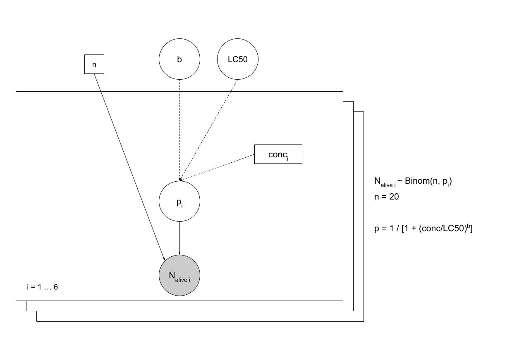

```{r setup, include=FALSE}
knitr::opts_chunk$set(echo = TRUE)
```

# Example of Bayesian inference on a model in ecotoxicology

Our aim is to study the effect of a toxic substance suspected to pollute lakes and rivers. We wish to model the effect of this substance on the death rate of daphnids (small invertebrates of fresh water, called "water feas").
An in vitro experiment has been conducted to observe the effect of the pollutant concentration on the death rate of 20 organisms after an exposition of 21 days.
The data for this experiment:

The tested concentrations (µg.ml<sup>-1</sup>): 0.19 0.38 0.76 1.53 3.05 6.11
The number of survivors among the 20 organisms: 16 12 4 3 1 1

We wish to estimate **LC50**, the concentration under which 50% of the organisms are dead after 21 days, with a
log-logistic modeling of the 21-days survival probability, through the formula:


## Model formalization



```{r}
library(rjags)

model1 <-
  "
  model {
  

  for (i in 1:N)
{
    N_alive[i] ~ dbin(p[i], n)
    p[i] <- 1 / (1 + (conc[i]/LC50)^b)
}

b ~ dunif(0, 10)
logLC50 ~ dunif(-1,1)
LC50 <- 10^logLC50

}
  "
```

## Data

```{r}
  conc <- c(0.19, 0.38, 0.76, 1.53, 3.05, 6.11)
  N_alive <- c(16, 12, 4, 3, 1, 1)
  N <- 6
  n <- 20

data_jags <- list(
  conc = conc,
  N_alive = N_alive,
  N = N,
  n = n
             )
```

## Initial values

Start values need to be in the fixed interval of prior distribution:

```{r}
init <- list(
  list(logLC50 = -0.99, b = 1),
  list(logLC50 = 0, b = 5),
  list(logLC50 = 0.99, b = 9))
```

## Implementation

### Simulations

```{r}
m <- jags.model(file=textConnection(model1),
                data = data_jags,
                inits = init,
                n.chains = 3
                )

update(m, 3000)
mcmc1 <- coda.samples(m, c("logLC50", "b"), n.iter = 5000)
```

### Minimal check of convergence

```{r include=FALSE}
mcmc1[1]
```

```{r}
plot(mcmc1)

require(lattice)
xyplot(mcmc1)

```

```{r}
summary(mcmc1)
```

```{r}
gelman.diag(mcmc1) # return only values of 1 for convergence
gelman.plot(mcmc1)

```
### Autocorrelation plot

```{r}
autocorr.plot(mcmc1[[1]])
effectiveSize(mcmc1)
raftery.diag(mcmc1)
```

## Evolution of MCMC quantiles over iterates

```{r}
cumuplot(mcmc1[[1]])
```

### Simulations without observed data (Monte Carlo)

```{r}
d0 <- list(conc = conc, n = n, N = N)
m0 <- jags.model(file = textConnection(model1), data = d0, n.chains = 1)
update(m0, 3000)
mc0 <- coda.samples(m0, c("b","LC50"), n.iter = 3000)
```

## Description of prior and posterior marginal distributions

It is a raw and easy-to-get representation, but poorly suited to uniform distributions (e.g. b prior) which would be better represented using the theoretical density rather than using the kernel density estimation from a sample.

```{r}
## Plot of prior densities
plot(mc0, trace = FALSE, density = TRUE)
```

```{r}
summary(mc0)

```

```{r}
## Plot of posterior densities
plot(mcmc1, trace = FALSE, density = TRUE)
```

```{r}
summary(mcmc1)
```

```{r}
mctot <- as.data.frame(as.matrix(mcmc1))
mcsample <- mctot[sample.int(nrow(mctot), size = 500), ]
## Plot of the joint posterior distribution as a scatter plot
pairs(mcsample)
```

