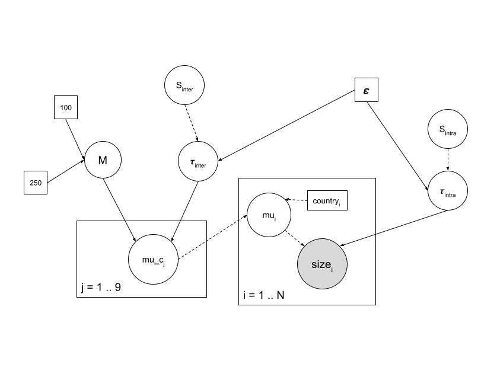

# An example of Bayesian inference on a Gaussian hierarchical model

``` r
data <- read.table("men_size2.txt", header = TRUE)
str(data)
```

    ## 'data.frame':    29 obs. of  2 variables:
    ##  $ country: chr  "Belgium" "Belgium" "Belgium" "Belgium" ...
    ##  $ size   : num  175 183 183 187 168 ...

``` r
stripchart(size~country, data=data, vertical=TRUE, pch=16,
method = "jitter")
```


## Estimating the mean of the distribution in a given country (mu_k) while ignoring data from other countries

### Model


``` r
library(rjags)
```

    ## Le chargement a nécessité le package : coda

    ## Linked to JAGS 4.3.0

    ## Loaded modules: basemod,bugs

``` r
desc_model_gauss1 <- "model
  { for (i in 1:N) {
    size[i] ~ dnorm(mu_k, tau_k)
  }
  mu_k ~ dunif(100,250)
  sigma_k <- 5.3
  tau_k <- 1/sigma_k^2
}"
```

### MCMC simulation

``` r
choice <- "France"
data_k <- subset(data, country==choice)
data_gauss1 <- with( data_k, list(size=size, N=length(size)))
init_gauss1 <- list(
  list(mu_k=150),
  list(mu_k=110),
  list(mu_k=190))

model_gauss1 <- jags.model(
  file=textConnection(desc_model_gauss1),
  data=data_gauss1, 
  inits=init_gauss1, 
  n.chains=3)
```

    ## Compiling model graph
    ##    Resolving undeclared variables
    ##    Allocating nodes
    ## Graph information:
    ##    Observed stochastic nodes: 3
    ##    Unobserved stochastic nodes: 1
    ##    Total graph size: 12
    ## 
    ## Initializing model

``` r
update(model_gauss1,3000)
mcmc_gauss1 <- coda.samples(model_gauss1, "mu_k", n.iter=50000, thin=10)
```

#### Minimal check of convergence

``` r
plot(mcmc_gauss1)
```


``` r
require(lattice)
```

    ## Le chargement a nécessité le package : lattice

``` r
xyplot(mcmc_gauss1)
```


``` r
summary(mcmc_gauss1)
```

    ## 
    ## Iterations = 4010:54000
    ## Thinning interval = 10 
    ## Number of chains = 3 
    ## Sample size per chain = 5000 
    ## 
    ## 1. Empirical mean and standard deviation for each variable,
    ##    plus standard error of the mean:
    ## 
    ##           Mean             SD       Naive SE Time-series SE 
    ##      175.45034        3.06960        0.02506        0.02570 
    ## 
    ## 2. Quantiles for each variable:
    ## 
    ##  2.5%   25%   50%   75% 97.5% 
    ## 169.5 173.4 175.4 177.5 181.5

``` r
cumuplot(mcmc_gauss1)
```


## Estimating the mean of the distribution for one country while taking into

account data from other countries as a prior distribution

``` r
desc_model_gauss2 <- "model
  { for (i in 1:N) {
    size[i] ~ dnorm(mu_k, tau_k)
  }
  mu_k ~ dnorm(Mnorm, sd)
  sd <- 1/Tnorm^2
  tau_k <- 1/sigma_k^2
  sigma_k <- 5.3
}"
```

``` r
# Chosen country and subset of others
choice <- "France"
others <- subset(data, country != choice)

# empirical means and number of countries
mean_others <- tapply(others$size, factor(others$country), mean)

# simple estimation of a normal distribution parameters
(M0 <- mean(mean_others))
```

    ## [1] 178.1396

``` r
(S0 <- sd(mean_others))
```

    ## [1] 3.722923

``` r
# data to pass to JAGS (including prior parameters)
data_k <- subset(data, country == choice)
data_gauss2 <- with(
  data_k,
  list(size =size, N=length(size), Mnorm=M0, Tnorm=S0))
```

``` r
init_gauss2 <- list(
  list(mu_k=150),
  list(mu_k=110),
  list(mu_k=190))

model_gauss2 <- jags.model(
  file=textConnection(desc_model_gauss2),
  data=data_gauss2, 
  inits=init_gauss2, 
  n.chains=3)
```

    ## Compiling model graph
    ##    Resolving undeclared variables
    ##    Allocating nodes
    ## Graph information:
    ##    Observed stochastic nodes: 3
    ##    Unobserved stochastic nodes: 1
    ##    Total graph size: 14
    ## 
    ## Initializing model

``` r
update(model_gauss2,3000)
mcmc_gauss2 <- coda.samples(model_gauss2, "mu_k", n.iter=50000, thin=10)
```

``` r
summary(mcmc_gauss2)
```

    ## 
    ## Iterations = 3010:53000
    ## Thinning interval = 10 
    ## Number of chains = 3 
    ## Sample size per chain = 5000 
    ## 
    ## 1. Empirical mean and standard deviation for each variable,
    ##    plus standard error of the mean:
    ## 
    ##           Mean             SD       Naive SE Time-series SE 
    ##      176.54207        2.35127        0.01920        0.01958 
    ## 
    ## 2. Quantiles for each variable:
    ## 
    ##  2.5%   25%   50%   75% 97.5% 
    ## 171.9 175.0 176.5 178.1 181.1

## Estimating the whole set of parameters for all countries in a Gaussian hierarchical model



``` r
desc_model_gauss3 <- "model
  { for (i in 1:nindiv) {
    size[i] ~ dnorm(mu[numcountry[i]], tau_intra)
    # mu_ind[i] <- mu[numcountry[i]]
  }
  
  for (j in 1:Ncountry) {
    mu[j] ~ dnorm(M, tau_inter)
  }
  
  M ~ dunif(100, 250)
  
  tau_intra ~ dgamma(eps, eps)
  tau_inter ~ dgamma(eps, eps)
  
  S_intra <- sqrt(1/tau_intra)
  S_inter <- sqrt(1/tau_inter)
}"
```

``` r
# Vector of (unique) country names and length of this vector
countries <- unique(data$country)
ncountries <- length(countries)

# Vector of individual measures and countries for these individuals,
# length of these vectors (number of individuals)
size <- data$size
numcountry <- match(data$country, countries)
nindiv <- nrow(data)
```

``` r
# Data passed to JAGS
# epsilon <- 0.001
# data_gauss3 <- list(
  # size=size,
  # numcountry=numcountry,
  # Ncountry=ncountries,
  # nindiv=nrow(data),
  # eps=epsilon)

# init_gauss3 <- list(list(M=150, tau_inter=1, tau_intra= 1), list(M=110, tau_inter=0.4, tau_intra= 0.4), list(M=190, tau_inter=0.2, tau_intra= 0.2))


# model_gauss3 <- jags.model(
#   file=textConnection(desc_model_gauss3),
#   data=data_gauss3,
#   inits=init_gauss3,
#   n.chains=3)
# 
# update(model_gauss3,3000)

# mcmc_gauss3 <- coda.samples(model_gauss3, "M", "S_inter", "S_intra", n.iter=50000, thin=10)
```

``` r
#Modele_3
model_3 <- "model{ 
  for (j in 1:ncountries) {
    mu[j] ~ dnorm(M, Tinter)
  }
  for (i in 1:nindiv) {
    size[i] ~ dnorm(mu[numcountry[i]], Tintra)
  }
  Tinter ~ dgamma(epsilon,epsilon)
  Tintra ~ dgamma(epsilon,epsilon)
  sigma_inter <- 1/sqrt(Tinter)
  sigma_intra <- 1/sqrt(Tintra)
  M ~ dunif(100, 250)
}"

# Vector of (unique) country names and length of this vector
countries <- unique(data$country)
ncountries <- length(countries)
# Vector of individual measures and countries for these individuals,
# length of these vectors (number of individuals)
size <- data$size
numcountry <- match(data$country, countries)
nindiv <- nrow(data)
# Data passed to JAGS
epsilon1 <- 0.001
epsilon2 <- 0.01
epsilon3 <- 0.1
data4jags_3 <- list(size=size, numcountry=numcountry,
                  ncountries=ncountries, nindiv=nindiv, epsilon=epsilon2)
init <- list(list(M=150, Tinter=1, Tintra= 1), list(M=110, Tinter=0.4, Tintra= 0.4), list(M=190, Tinter=0.2, Tintra= 0.2))
modeljags_3 <- jags.model(file=textConnection(model_3),
                          data=data4jags_3, inits=init, n.chains=3)
```

    ## Compiling model graph
    ##    Resolving undeclared variables
    ##    Allocating nodes
    ## Graph information:
    ##    Observed stochastic nodes: 29
    ##    Unobserved stochastic nodes: 12
    ##    Total graph size: 80
    ## 
    ## Initializing model

``` r
update(modeljags_3,3000)
mcmc_3 <- coda.samples(modeljags_3, c("M", "mu", "sigma_inter", "sigma_intra"), n.iter=50000, thin=10)
summary(mcmc_3)
```

    ## 
    ## Iterations = 4010:54000
    ## Thinning interval = 10 
    ## Number of chains = 3 
    ## Sample size per chain = 5000 
    ## 
    ## 1. Empirical mean and standard deviation for each variable,
    ##    plus standard error of the mean:
    ## 
    ##                Mean     SD Naive SE Time-series SE
    ## M           177.928 1.2285 0.010030       0.019655
    ## mu[1]       178.902 1.8501 0.015106       0.025510
    ## mu[2]       177.834 1.6266 0.013281       0.020977
    ## mu[3]       178.257 1.6624 0.013573       0.020340
    ## mu[4]       177.463 1.7298 0.014123       0.023148
    ## mu[5]       177.910 1.5437 0.012604       0.020323
    ## mu[6]       177.268 1.8094 0.014774       0.023717
    ## mu[7]       179.216 2.1807 0.017806       0.029563
    ## mu[8]       177.159 1.8578 0.015169       0.025471
    ## mu[9]       177.494 1.7181 0.014028       0.023406
    ## sigma_inter   1.411 1.3516 0.011036       0.020336
    ## sigma_intra   5.420 0.8101 0.006614       0.007596
    ## 
    ## 2. Quantiles for each variable:
    ## 
    ##                  2.5%      25%      50%     75%   97.5%
    ## M           175.48049 177.1510 177.9348 178.721 180.302
    ## mu[1]       175.88877 177.6608 178.6414 179.883 183.225
    ## mu[2]       174.38244 176.8982 177.8739 178.832 181.015
    ## mu[3]       175.10737 177.2036 178.1666 179.201 181.892
    ## mu[4]       173.50872 176.5250 177.6157 178.565 180.518
    ## mu[5]       174.76761 176.9768 177.9133 178.878 180.989
    ## mu[6]       172.91565 176.3372 177.4785 178.450 180.315
    ## mu[7]       175.95244 177.7233 178.8117 180.275 184.588
    ## mu[8]       172.72704 176.2057 177.4034 178.384 180.177
    ## mu[9]       173.62555 176.5495 177.6366 178.580 180.549
    ## sigma_inter   0.09358   0.3461   0.9672   2.126   4.787
    ## sigma_intra   4.04665   4.8526   5.3355   5.903   7.236

``` r
# Quand on augmente de 100 le epsilon, la median de sigma_inter augmente
```

### Uniform prior

``` r
desc_model_unif_10 <- "model{ 
  for (j in 1:ncountries) {
    mu[j] ~ dnorm(M, Tinter)
  }
  for (i in 1:nindiv) {
    size[i] ~ dnorm(mu[numcountry[i]], Tintra)
  }
  Tinter ~ dunif(0, 10)
  Tintra ~ dunif(0, 10)
  sigma_inter <- 1/sqrt(Tinter)
  sigma_intra <- 1/sqrt(Tintra)
  M ~ dunif(100, 250)
}"
```

``` r
data_jags_unif_10 <- list(size=size, numcountry=numcountry,
                  ncountries=ncountries, nindiv=nindiv)
init_unif_10 <- list(list(M=150, Tinter=1, Tintra= 1), list(M=110, Tinter=5, Tintra= 5), list(M=190, Tinter=9, Tintra=9))
model_unif_10 <- jags.model(file=textConnection(desc_model_unif_10),
                          data=data_jags_unif_10, inits=init_unif_10, n.chains=3)
```

    ## Compiling model graph
    ##    Resolving undeclared variables
    ##    Allocating nodes
    ## Graph information:
    ##    Observed stochastic nodes: 29
    ##    Unobserved stochastic nodes: 12
    ##    Total graph size: 81
    ## 
    ## Initializing model

``` r
update(model_unif_10,3000)
mcmc_unif_10 <- coda.samples(model_unif_10, c("M", "sigma_inter", "sigma_intra"), n.iter=50000, thin=10)
summary(mcmc_unif_10)
```

    ## 
    ## Iterations = 4010:54000
    ## Thinning interval = 10 
    ## Number of chains = 3 
    ## Sample size per chain = 5000 
    ## 
    ## 1. Empirical mean and standard deviation for each variable,
    ##    plus standard error of the mean:
    ## 
    ##                Mean     SD Naive SE Time-series SE
    ## M           177.984 1.0452 0.008534       0.023558
    ## sigma_inter   0.640 0.4973 0.004060       0.005692
    ## sigma_intra   5.353 0.7380 0.006026       0.006520
    ## 
    ## 2. Quantiles for each variable:
    ## 
    ##                 2.5%      25%      50%      75%   97.5%
    ## M           175.9622 177.2905 177.9853 178.6640 180.026
    ## sigma_inter   0.3206   0.3701   0.4633   0.6837   2.152
    ## sigma_intra   4.1142   4.8413   5.2766   5.7820   7.008

### Cauchy prior

``` r
desc_model_cauchy <- "model{ 
  for (j in 1:ncountries) {
    mu[j] ~ dnorm(M, Tinter)
  }
  for (i in 1:nindiv) {
    size[i] ~ dnorm(mu[numcountry[i]], Tintra)
  }
  Tinter ~ dt(0, 1/scale^2, 1)T(0,)
  Tintra ~ dt(0, 1/scale^2, 1)T(0,)

  sigma_inter <- 1/sqrt(Tinter)
  sigma_intra <- 1/sqrt(Tintra)
  M ~ dunif(100, 250)
}"
```

``` r
data_jags_cauchy <- list(size=size, numcountry=numcountry,
                  ncountries=ncountries, nindiv=nindiv, scale=5)
init_cauchy <- list(list(M=150, Tinter=1, Tintra= 1), list(M=110, Tinter=5, Tintra= 5), list(M=190, Tinter=9, Tintra=9))
model_cauchy <- jags.model(file=textConnection(desc_model_cauchy),
                          data=data_jags_cauchy, inits=init_cauchy, n.chains=3)
```

    ## Compiling model graph
    ##    Resolving undeclared variables
    ##    Allocating nodes
    ## Graph information:
    ##    Observed stochastic nodes: 29
    ##    Unobserved stochastic nodes: 12
    ##    Total graph size: 84
    ## 
    ## Initializing model

``` r
update(model_cauchy,3000)
mcmc_cauchy <- coda.samples(model_cauchy, c("M", "mu", "sigma_inter", "sigma_intra"), n.iter=50000, thin=10)
summary(mcmc_cauchy)
```

    ## 
    ## Iterations = 4010:54000
    ## Thinning interval = 10 
    ## Number of chains = 3 
    ## Sample size per chain = 5000 
    ## 
    ## 1. Empirical mean and standard deviation for each variable,
    ##    plus standard error of the mean:
    ## 
    ##                 Mean     SD Naive SE Time-series SE
    ## M           177.9669 1.0237 0.008358       0.022591
    ## mu[1]       178.2851 1.2707 0.010375       0.022932
    ## mu[2]       177.9314 1.1901 0.009717       0.022130
    ## mu[3]       178.0756 1.2118 0.009894       0.022770
    ## mu[4]       177.8219 1.2297 0.010041       0.023024
    ## mu[5]       177.9482 1.1845 0.009671       0.022306
    ## mu[6]       177.7401 1.2630 0.010312       0.023749
    ## mu[7]       178.3616 1.3675 0.011166       0.023775
    ## mu[8]       177.7071 1.2855 0.010496       0.024113
    ## mu[9]       177.8232 1.2382 0.010110       0.022964
    ## sigma_inter   0.6485 0.5859 0.004784       0.007954
    ## sigma_intra   5.3572 0.7401 0.006043       0.006186
    ## 
    ## 2. Quantiles for each variable:
    ## 
    ##                 2.5%      25%      50%      75%   97.5%
    ## M           175.9397 177.2938 177.9719 178.6485 179.959
    ## mu[1]       175.9847 177.4659 178.2206 179.0180 181.071
    ## mu[2]       175.5312 177.1733 177.9378 178.7140 180.202
    ## mu[3]       175.7493 177.2930 178.0612 178.8304 180.546
    ## mu[4]       175.2931 177.0710 177.8638 178.6148 180.128
    ## mu[5]       175.5913 177.1968 177.9665 178.7106 180.258
    ## mu[6]       175.0312 177.0118 177.8116 178.5711 180.017
    ## mu[7]       175.9968 177.4808 178.2660 179.0977 181.445
    ## mu[8]       174.9089 176.9542 177.7935 178.5489 180.018
    ## mu[9]       175.2847 177.0550 177.8684 178.6298 180.121
    ## sigma_inter   0.1053   0.3029   0.4746   0.7621   2.345
    ## sigma_intra   4.1244   4.8342   5.2881   5.7958   7.017

Dans le modele hierarchique on considere que les differentes unités (ici
les pays) ne sont pas independants, la moyenne observée sur une unité
depend aussi des moyennes des autres.  
Cela ca peut se reveler utilie lorsque on cherche a estimer la moyenne
d’un pays pour lequel on a tres peu de données et ainsi on utilise les
données des autres pays pour modeliser celui-ci.  
On dit alors qu’on “*shrink*” vers la moyenne generale des differents
pays.
