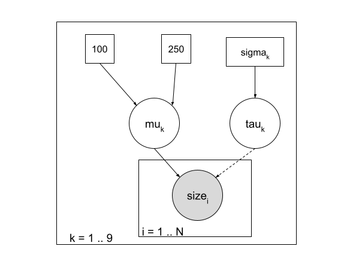
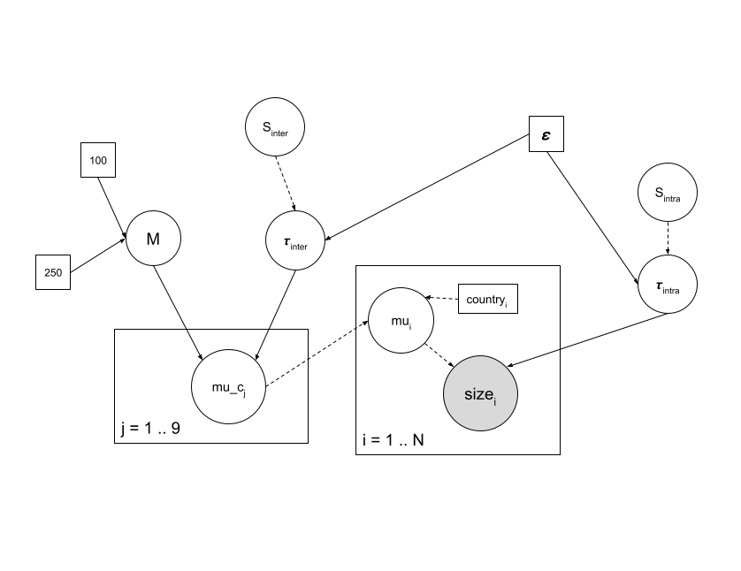

```{r setup, include=FALSE}
knitr::opts_chunk$set(echo = TRUE)
```

# An example of Bayesian inference on a Gaussian hierarchical model

```{r}
data <- read.table("men_size2.txt", header = TRUE)
str(data)

stripchart(size~country, data=data, vertical=TRUE, pch=16,
method = "jitter")
```

## Estimating the mean of the distribution in a given country (mu_k) while ignoring data from other countries

### Model



```{r}
library(rjags)
desc_model_gauss1 <- "model
  { for (i in 1:N) {
    size[i] ~ dnorm(mu_k, tau_k)
  }
  mu_k ~ dunif(100,250)
  sigma_k <- 5.3
  tau_k <- 1/sigma_k^2
}"
```

### MCMC simulation

```{r}
choice <- "France"
data_k <- subset(data, country==choice)
data_gauss1 <- with( data_k, list(size=size, N=length(size)))
init_gauss1 <- list(
  list(mu_k=150),
  list(mu_k=110),
  list(mu_k=190))

model_gauss1 <- jags.model(
  file=textConnection(desc_model_gauss1),
  data=data_gauss1, 
  inits=init_gauss1, 
  n.chains=3)
update(model_gauss1,3000)
mcmc_gauss1 <- coda.samples(model_gauss1, "mu_k", n.iter=50000, thin=10)
```

#### Minimal check of convergence

```{r}
plot(mcmc_gauss1)

require(lattice)

xyplot(mcmc_gauss1)
```

```{r}
summary(mcmc_gauss1)
```

```{r}
cumuplot(mcmc_gauss1)
```

## Estimating the mean of the distribution for one country while taking into

account data from other countries as a prior distribution

```{r}
desc_model_gauss2 <- "model
  { for (i in 1:N) {
    size[i] ~ dnorm(mu_k, tau_k)
  }
  mu_k ~ dnorm(Mnorm, sd)
  sd <- 1/Tnorm^2
  tau_k <- 1/sigma_k^2
  sigma_k <- 5.3
}"
```

```{r}
# Chosen country and subset of others
choice <- "France"
others <- subset(data, country != choice)

# empirical means and number of countries
mean_others <- tapply(others$size, factor(others$country), mean)

# simple estimation of a normal distribution parameters
(M0 <- mean(mean_others))
(S0 <- sd(mean_others))

# data to pass to JAGS (including prior parameters)
data_k <- subset(data, country == choice)
data_gauss2 <- with(
  data_k,
  list(size =size, N=length(size), Mnorm=M0, Tnorm=S0))
```

```{r}
init_gauss2 <- list(
  list(mu_k=150),
  list(mu_k=110),
  list(mu_k=190))

model_gauss2 <- jags.model(
  file=textConnection(desc_model_gauss2),
  data=data_gauss2, 
  inits=init_gauss2, 
  n.chains=3)
update(model_gauss2,3000)
mcmc_gauss2 <- coda.samples(model_gauss2, "mu_k", n.iter=50000, thin=10)
```

```{r}
summary(mcmc_gauss2)
```

## Estimating the whole set of parameters for all countries in a Gaussian hierarchical model



```{r}
desc_model_gauss3 <- "model
  { for (i in 1:nindiv) {
    size[i] ~ dnorm(mu_i, tau_intra)
    # pas oblige de mettre le noeud intermediaire mu_i
    mu_i <- mean()
  }
  
  for (j in 1:Ncountry) {
    mu[numcountry] ~ dnorm(M, tau_inter)
  }
  
  M ~ dunif(100, 250)
  
  tau_intra ~ dgamma(eps, eps)
  tau_inter ~ dgamma(eps, eps)
  
  S_intra <- sqrt(1/tau_intra)
  S_inter <- sqrt(1/tau_inter)
}"
```

```{r}
# Vector of (unique) country names and length of this vector
countries <- unique(data$country)
ncountries <- length(countries)

# Vector of individual measures and countries for these individuals,
# length of these vectors (number of individuals)
size <- data$size
numcountry <- match(data$country, countries)
nindiv <- nrow(data)

# Data passed to JAGS
epsilon <- 0.001
data_gauss3 <- list(
  size=size, 
  numcountry=numcountry,
  Ncountry=ncountries, 
  nindiv=nindiv, 
  eps=epsilon)
```

```{r}
init_gauss3 <- list(
  list(mu_j=150),
  list(mu_j=110),
  list(mu_j=190))

model_gauss3 <- jags.model(
  file=textConnection(desc_model_gauss3),
  data=data_gauss3, 
  inits=init_gauss3, 
  n.chains=3)
update(model_gauss3,3000)
mcmc_gauss2 <- coda.samples(model_gauss3, "M", "S_inter", "Sintra", n.iter=50000, thin=10)
```
