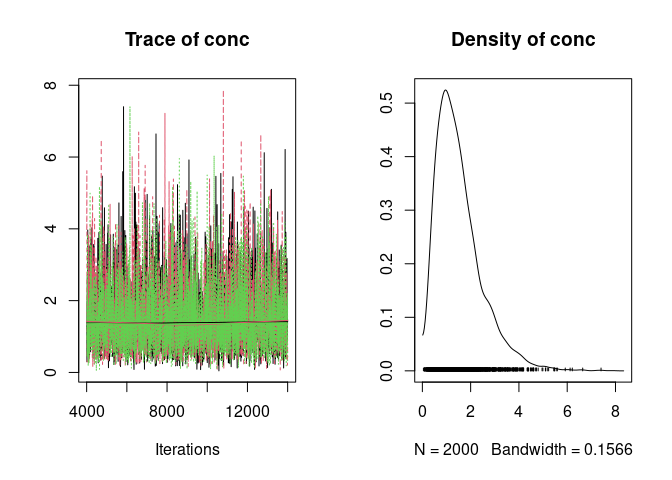
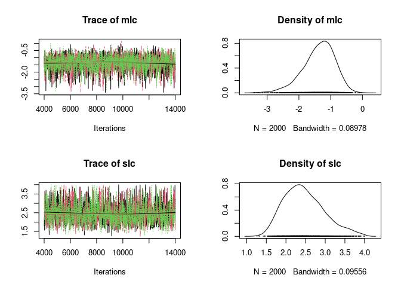
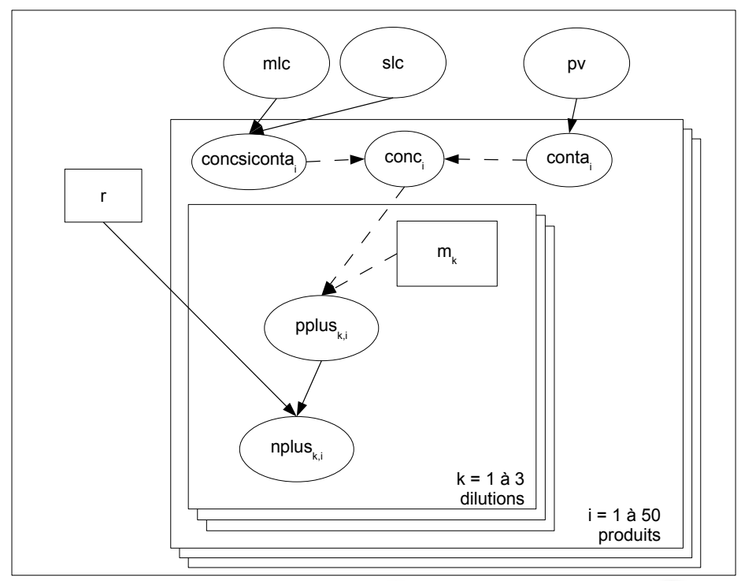
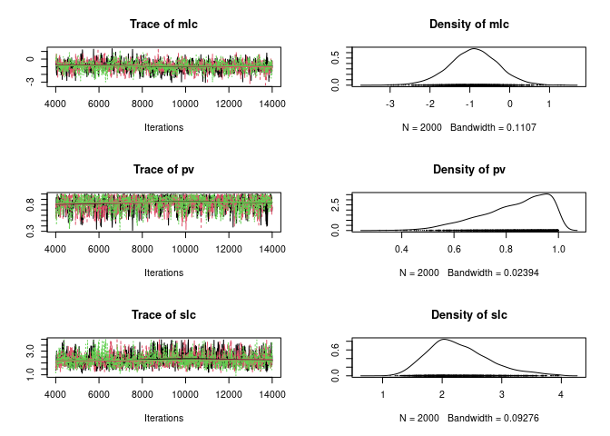

## Context

On souhaite estimer le niveau de contamination, par une bactérie
pathogène donnée, d’un produit alimentaire donné, au sein de la
production française. Pour cela on tire au hasard 50 produits issus de
la production française. Chaque produit fait l’objet d’une analyse
microbiologique suivant la méthode dite du Nombre le Plus Probable
(NPP). Cette méthode consiste à mettre en culture des échantillons du
produit dilués à trois dilutions décimales successives. En pratique,
pour chaque produit, sont mis en culture r = 3 tubes contenant m1 = 1g
du produit, r = 3 tubes contenant m2 = 0.1g du produit et r = 3 tubes
contenant m3 = 0.01g du produit. Le résultat brut de l’analyse
microbiologique effectuée sur chaque produit est constitué par les
nombres de tubes positifs à chacune des trois dilutions : nplus1, nplus2
et nplus3. Pour analyser les résultats pour chaque produit, c’est-à-dire
estimer la concentration en bactéries dans le produit lorsque c’est
possible, on fera l’hypothèse que les bactéries sont réparties de façon
homogène au départ dans le produit. On peut donc caractériser le nombre
de bactéries n pour une masse m prélevée dans un produit caractérisé par
une concentration en bactéries conc, par la loi de Poisson:
$P (n=x) = e^{-m \\times conc} \\times \\frac{(m \\times conc)^x}{x!}$

On supposera par ailleurs que dès qu’une bactérie est présente dans un
tube, celui-ci est forcément positif après culture, et qu’il n’y a aucun
faux positif: le tube ne peut être positif que s’il y a au moins une
bactérie à l’intérieur avantculture. Les données d’un des 50 produits
ont été codées en R de la façon suivante:

    d <- list(m = c(1, 0.1, 0.01), nplus = c(2, 1, 0), r = 3)

## Question 1

Tracez le graphe acyclique dirigé du modèle permettant d’estimer la
concentration `conc` à partir des résultats obtenus sur ce produit puis
définissez mathématiquement ses liens (en différenciant bien les liens
stochastiques et les liens déterministes).

### Model formalization

*n**p**l**u**s**i* : nombre de tubes positifs pour
chaque dilution.  
*n**p**l**u**s**i* ∼ *B*(*p*(*t*), *r*)  
*N**b**a**c**t**e**r**i**a* ∼ *P**o**i**s*(*m**i* × *c**o**n**c*)

Probabilité qu’un tube soit
positif:*p*(*t*) = *p*(*N**b**a**c**t**e**r**i**a* ≥ 1) = 1 − *p*(*N**b**a**c**t**e**r**i**a* = 0) = 1 − *e* − *m**i* × *c**o**n**c*

On considérera une loi vaguement informative sur le paramètre de
concentration `conc`, dont on pense qu’il est compris entre
10 − 6 et 103*U**F**C* × *g* − 1 (on
définira pour cela une loi uniforme sur le logarithme de la
concentration).  
En utilisant **JAGS** et **rjags**, vous implémenterez le modèle,
simulerez 3 chaînes MCMC avec suffisamment d’itérations pour atteindre
la convergence et estimer les paramètres du modèle, ponctuellement et
par intervalle.

    library(rjags)

    ## Le chargement a nécessité le package : coda

    ## Linked to JAGS 4.3.0

    ## Loaded modules: basemod,bugs

    desc_model_npp <- 
      "model
    {
    conc <- pow(10,log10c) # concentration dans l'echantillon en UFC/g
    for (k in 1:3)
    {
    pplus[k] <- 1 - exp(-conc*m[k]) # proba qu'un tube de la keme dilution soit contamine
    nplus[k] ~ dbin(pplus[k],r) # nb de tubes positifs pour la dilution k
    }
    # A priori sur le parametre
    log10c ~ dunif(-6,3) # concentration dans les melees contaminees en log10 (UFC/g)
    }"

    init_npp <- list(
      list(log10c = -2), 
      list(log10c = 0), 
      list(log10c = 1))

    model_npp <- jags.model(file = textConnection(desc_model_npp), data = d, inits = init_npp, n.chains = 3)

    ## Compiling model graph
    ##    Resolving undeclared variables
    ##    Allocating nodes
    ## Graph information:
    ##    Observed stochastic nodes: 3
    ##    Unobserved stochastic nodes: 1
    ##    Total graph size: 24
    ## 
    ## Initializing model

    update(model_npp, 3000)
    mcmc_npp <- coda.samples(model_npp, c("conc"), thin = 5, n.iter = 10000)

    plot(mcmc_npp)

    gelman.diag(mcmc_npp)

    ## Potential scale reduction factors:
    ## 
    ##      Point est. Upper C.I.
    ## conc          1          1

    summary(mcmc_npp)

    ## 
    ## Iterations = 4005:14000
    ## Thinning interval = 5 
    ## Number of chains = 3 
    ## Sample size per chain = 2000 
    ## 
    ## 1. Empirical mean and standard deviation for each variable,
    ##    plus standard error of the mean:
    ## 
    ##           Mean             SD       Naive SE Time-series SE 
    ##        1.52617        0.95421        0.01232        0.01232 
    ## 
    ## 2. Quantiles for each variable:
    ## 
    ##   2.5%    25%    50%    75%  97.5% 
    ## 0.3065 0.8487 1.3263 1.9762 3.9416

### Interprétation des résultats

Les chaînes MCMC convergent assez facilement et l’on peut estimer la
concentration dans ce produit alimentaire à
1.3*U**F**C* × *g* − 1 avec un intervalle de crédibilité à
95% de \[0.3, 3.9\].

## Question 2

Les données obtenues pour l’ensemble des 50 produits ont été codées avec
les mêmes notations que précédemment dans le jeu de données `dcomplet`:

    nplus <- read.table(file = "dataNPP2.txt")
    (dcomplet <- list(m = c(1, 0.1, 0.01), nplus = nplus, r = 3, N = 50))

    ## $m
    ## [1] 1.00 0.10 0.01
    ## 
    ## $nplus
    ##   V1 V2 V3 V4 V5 V6 V7 V8 V9 V10 V11 V12 V13 V14 V15 V16 V17 V18 V19 V20 V21
    ## 1  3  1  0  0  3  0  0  2  0   0   0   0   1   0   0   1   0   1   0   3   2
    ## 2  3  0  0  0  3  0  0  1  0   0   0   0   0   0   0   0   0   0   0   3   0
    ## 3  1  0  0  0  0  0  0  0  0   0   0   0   0   0   0   0   0   0   0   3   0
    ##   V22 V23 V24 V25 V26 V27 V28 V29 V30 V31 V32 V33 V34 V35 V36 V37 V38 V39 V40
    ## 1   1   3   1   0   3   0   3   2   0   0   0   0   0   1   3   0   0   0   0
    ## 2   0   2   0   0   1   0   1   1   0   0   0   1   0   0   3   0   0   0   0
    ## 3   0   0   0   0   0   0   0   0   0   0   0   0   0   0   3   0   0   0   0
    ##   V41 V42 V43 V44 V45 V46 V47 V48 V49 V50
    ## 1   3   0   3   0   2   0   0   0   3   0
    ## 2   3   0   3   0   0   0   0   0   3   0
    ## 3   3   0   3   0   0   0   0   0   2   0
    ## 
    ## $r
    ## [1] 3
    ## 
    ## $N
    ## [1] 50

A partir de ces données, on voudrait modéliser la variabilité de la
concentration bactérienne au sein des produits de la production
française. Pour cela deux modèles sont envisagés:

-   Dans le **premier modèle**, on supposera tout simplement une
    distribution lognormale de la concentration (paramètre `conc`) au
    sein de la production. On a donc un modèle à deux paramètres, `mlc`
    et `slc`. Pour défnir les distributions *a priori*, on considérera
    que la moyenne `mlc` de `log10(conc)` se situe entre -6 et 3 (loi
    uniforme sur `mlc`) et que l’écart type `slc` de `log10(conc)` se
    situe entre 0 et 4 (loi uniforme sur `slc`). Vous implémenterez
    ensuite le modèle, simulerez 3 chaînes MCMC avec suffisamment
    d’itérations pour atteindre la convergence et estimer les paramètres
    du modèle.  
    Enfin vous interpréterez les résultats obtenus avec ce modèle.

$log\_{10}conc\_i \\sim N(mlc), \\tau = \\frac{1}{slc^2}$

*p**p**l**u**s**k*, *i* = 1 − *e**x**p*( − *c**o**n**c**i* × *m**k*)

*n**p**l**u**s**k*, *i* ∼ *B**i**n**o**m*(*p**p**l**u**s**k*, *i*, *r*)

    desc_model_npp2 <- 
    "model
    {
      for (i in 1:N)
      {
        log10c[i] ~ dnorm(mlc, taulc)
        conc[i] <- pow(10, log10c[i]) # concentration dans l'echantillon en UFC/g
        
        for (k in 1:3)
        {
          pplus[k,i] <- 1 - exp(-conc[i] * m[k]) # proba qu'un tube de la keme dilution soit contamine
          nplus[k,i] ~ dbin(pplus[k, i], r) # nb de tubes positifs pour la dilution k
        }
      }
      # A priori sur les parametres
      mlc ~ dunif(-6, 3) # moy de log concentration dans les melees contaminees en log10 (UFC/g)
      slc ~ dunif(0, 4) # sd de log concentration dans les melees contaminees en log10 (UFC/g)
      taulc <- 1 / pow(slc,2)
    }"

    init_npp2 <- list(
      list(mlc = -2, slc = 1),
      list(mlc = 0, slc = 3),
      list(mlc = 1, slc = 2)
    )

    model_npp2 <- jags.model(file=textConnection(desc_model_npp2),
                             data = dcomplet,
                             inits = init_npp2,
                             n.chains = 3)

    ## Compiling model graph
    ##    Resolving undeclared variables
    ##    Allocating nodes
    ## Graph information:
    ##    Observed stochastic nodes: 150
    ##    Unobserved stochastic nodes: 52
    ##    Total graph size: 767
    ## 
    ## Initializing model

    update(model_npp2, 3000)

    mcmc_npp2 <- coda.samples(model_npp2, c("mlc", "slc"), n.iter = 10000, thin = 5)

    plot(mcmc_npp2)

    gelman.diag(mcmc_npp2)

    ## Potential scale reduction factors:
    ## 
    ##     Point est. Upper C.I.
    ## mlc          1          1
    ## slc          1          1
    ## 
    ## Multivariate psrf
    ## 
    ## 1

    summary(mcmc_npp2)

    ## 
    ## Iterations = 4005:14000
    ## Thinning interval = 5 
    ## Number of chains = 3 
    ## Sample size per chain = 2000 
    ## 
    ## 1. Empirical mean and standard deviation for each variable,
    ##    plus standard error of the mean:
    ## 
    ##       Mean     SD Naive SE Time-series SE
    ## mlc -1.373 0.4998 0.006453        0.01098
    ## slc  2.465 0.5136 0.006630        0.01331
    ## 
    ## 2. Quantiles for each variable:
    ## 
    ##       2.5%    25%    50%    75%   97.5%
    ## mlc -2.502 -1.669 -1.322 -1.022 -0.5465
    ## slc  1.629  2.087  2.409  2.791  3.6311

#### Interprétation des résultats

Là encore les chaînes MCMC convergent relativement facilement (quelques
itérations supplémentaires seraient néanmoins souhaitables) et l’on peut
estimer les paramètres de la loi de variabilité de la concentration au
sein des produits par les estimations ponctuelles et intervalles de
crédibilité à 95% suivants:

-   pour `mlc` -1.3 \[-2.5, -0.5\]

-   pour `slc` 2.4 \[1.6, 3.6\]

Les lois *a posteriori* sont resserrées par rapport aux lois *a priori*,
mais restent néanmoins assez étendues. Les données ne permettent pas une
estimation très précise des paramètres de ce modèle. Par ailleurs la
borne supérieure de l’intervalle de crédibilité à 95% pour `slc` est
assez proche de la borne supérieure de sa loi *a priori*. Sachant que
cette borne n’a pas été définie à partir d’une connaissance *a priori*
forte, il serait prudent de vérifier que cette loi *a priori* n’est pas
trop contraignante en testant la robustesse des résultats par rapport à
cette borne supérieure de la loi *a priori*.

-   Dans le **deuxième modèle**, on supposera que seule une proportion
    `pv` de la production est contaminée par la bactérie étudiée (avec
    une loi *a priori* uniforme entre 0 et 1 sur ce paramètre), et qu’au
    sein des produits contaminés, la distribution de la concentration
    suit la loi décrite dans le premier modèle.  
    On a donc un modèle à trois paramètres, `mlc`, `slc` et `pv`.
    Ecrivez les liens qui relient les trois paramètres à la
    concentration conci du produit i dans ce modèle. Vous implémenterez
    ensuite le modèle, simulerez 3 chaînes MCMC avec suffisamment
    d’itérations pour atteindre la convergence et estimer les paramètres
    du modèle.  
    Interprétez les résultats obtenus avec ce deuxième modèle,
    ATTENTION, vous allez sans doute être confronté à une petite
    difficulté liée au fait que **JAGS** n’autorise pas le paramètre
    d’une loi de Bernouilli (ou d’une loi binomiale) à être nulle, car
    le lien passerait alors de l’état de stochastique à celui de
    déterministe. Pour pallier ce problème on remplace généralement la
    valeur 0 par une toute petite valeur dans ces cas-là.

Introduction d’une variable latente codant pour le status (contaminé ou
non) du produit:

*c**o**n**t**a**i* ∼ *B**e**r**n**o**u**i**l**l**u*(*p**v*)

Definition de la concentration du produit `i`:

$\\log\_{10}(concsiconta\_i) \\sim N(mlc, \\tau = \\frac{1}{slc^2})$

si *c**o**n**t**a**i* = 0, *c**o**n**c**i* = 0

si *c**o**n**t**a**i* = 1,
*c**o**n**c**i* = *c**o**n**c**s**i**c**o**n**t**a**i*

#### Code du modèle

    desc_model_npp3 <-
      "model
    {
      for (i in 1:N)
    {
    conta[i] ~ dbern(pv)
    log10c[i] ~ dnorm(mlc,taulc)
    conc[i] <- pow(10,log10c[i]) * conta[i]
    for (k in 1:3)
    {
    pplus[k,i] <- max(1 - exp(-conc[i]*m[k]),0.00000000001)
    nplus[k,i] ~ dbin(pplus[k,i],r)
    }
    }
    # A priori sur les parametres
    mlc ~ dunif(-6,3) # moy de log concentration dans les melees contaminees en log10 (UFC/g)
    slc ~ dunif(0,4) # sd de log concentration dans les melees contaminees en log10 (UFC/g)
    taulc <- 1 / pow(slc,2)
    pv ~ dbeta(1,1) # proportion de produits contamines
    }"

    init_npp3 <- list(list(mlc = -2, slc = 1, pv = 0.1),
                      list(mlc = 0, slc = 3, pv = 0.5),
                      list(mlc = 1, slc = 2, pv = 0.9))

    model_npp3 <- jags.model(file = textConnection(desc_model_npp3), 
                             data = dcomplet, 
                             inits = init_npp3, 
                             n.chains = 3)

    ## Compiling model graph
    ##    Resolving undeclared variables
    ##    Allocating nodes
    ## Graph information:
    ##    Observed stochastic nodes: 150
    ##    Unobserved stochastic nodes: 103
    ##    Total graph size: 1019
    ## 
    ## Initializing model

    update(model_npp3, 3000)
    mcmc_npp3 <- coda.samples(model_npp3, c("mlc", "slc", "pv"), n.iter = 10000, thin = 5)

    plot(mcmc_npp3)

    gelman.diag(mcmc_npp3)

    ## Potential scale reduction factors:
    ## 
    ##     Point est. Upper C.I.
    ## mlc       1.00       1.01
    ## pv        1.00       1.00
    ## slc       1.01       1.03
    ## 
    ## Multivariate psrf
    ## 
    ## 1.01

    summary(mcmc_npp3)

    ## 
    ## Iterations = 4005:14000
    ## Thinning interval = 5 
    ## Number of chains = 3 
    ## Sample size per chain = 2000 
    ## 
    ## 1. Empirical mean and standard deviation for each variable,
    ##    plus standard error of the mean:
    ## 
    ##        Mean     SD Naive SE Time-series SE
    ## mlc -0.9052 0.6140 0.007927       0.020583
    ## pv   0.8300 0.1287 0.001661       0.004262
    ## slc  2.2817 0.5143 0.006640       0.015400
    ## 
    ## 2. Quantiles for each variable:
    ## 
    ##        2.5%     25%     50%     75%  97.5%
    ## mlc -2.1559 -1.2990 -0.9025 -0.5015 0.2966
    ## pv   0.5376  0.7479  0.8568  0.9352 0.9946
    ## slc  1.4521  1.9175  2.2104  2.5855 3.5035

    crosscorr(mcmc_npp3)

    ##            mlc         pv        slc
    ## mlc  1.0000000 -0.6084321 -0.5272707
    ## pv  -0.6084321  1.0000000  0.3057727
    ## slc -0.5272707  0.3057727  1.0000000

#### Interprétation des résultats

Les chaînes MCMC convergent relativement facilement (là encore quelques
itérations supplémentaires seraient néanmoins souhaitables), mais on
peut voir que le nouveau paramètre `pv` est estimé assez haut, avec un
mode de la distribution *a posteriori* proche de 1, borne de sa loi *a
priori*, borne par ailleurs maximale pour une proportion. Il a pourra
d’ailleurs être intéressant sur cet exemple, plus tard dans ce cours,
d’évaluer l’impact de la forme de la distribution *a priori* de `pv` sur
l’estimation de ce paramètre. Dans tous les cas, il semble que les
données ne permettent donc pas d’affirmer qu’il existe bien une partie
des produits qui ne sont pas contaminés.

**Quel choix feriez-vous entre ces deux modèles? Argumentez votre
choix.** Les résultats de l’inférence ne mettant pas en évidence que le
paramètre `pv` est différent de 1, s’il n’y a pas par ailleurs
d’évidence biologique motivant le choix du dernier modèle, par principe
de parcimonie (recherche du modèle le plus simple permettant de bien
décrire les données), le modèle à seulement deux paramètres `mlc` et
`slc` pourrait être choisi.

**Quelle difficulté rencontrerions-nous si nous voulions ajuster l’un de
ces deux modèles par une procédure à deux étapes (observez bien les
données pour répondre):**

-   Etape 1 : estimation de la concentration pour chaque produit;

-   Etape 2 : estimation des paramètres du modèle complet à partir des
    concentrations estimées pour chaque produit.

**Quels avantages voyez-vous à l’utilisation d’une méthode en une seule
étape par inférence bayésienne par rapport à une procédure en deux
étapes utilisant le maximum de vraisemblance à chaque étape ?** Si l’on
regarde bien les observations (nombres de tubes positifs pour chaque
produit), on s’aperçoit que pour certains d’entre eux il n’y a aucun
tube positif, à aucune dilution. L’étape 1 serait donc impossible pour
ces produits. Néanmoins ces zéros apportent bien une information,
indiquant que la concentration est faible voire nulle. On biaiserait
donc les résultats en enlevant ces données de l’analyse. L’approche de
modélisation hiérarchique en une seule étape, facile à réaliser en
inférence bayésienne, permet de tenir compte proprement de toutes les
données disponibles.
