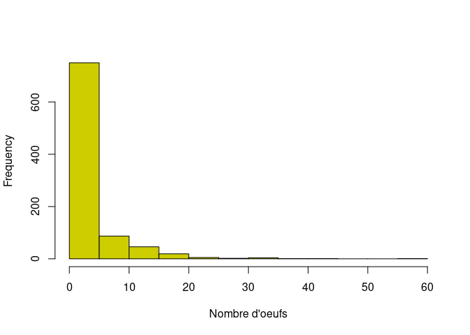
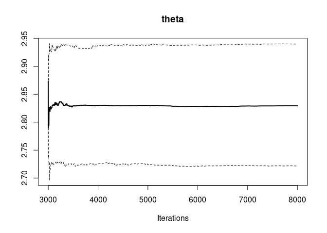
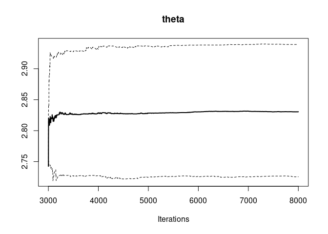
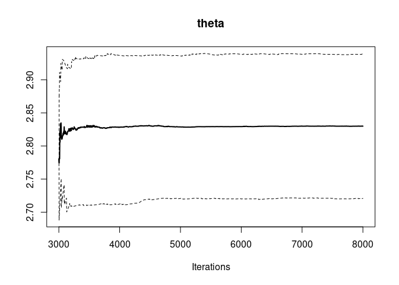

# Schistosomes

``` r
data_eggs <- read.table("schisto.txt", header = T, sep = ",")
hist(data_eggs$y, xlab = "Nombre d'oeufs", col = "yellow3", main = "")
```



``` r
summary(data_eggs$y)
```

    ##    Min. 1st Qu.  Median    Mean 3rd Qu.    Max. 
    ##   0.000   0.000   0.000   2.824   3.000  60.000

``` r
sd(data_eggs$y)
```

    ## [1] 5.641058

# Implementation

## DAG modèle de Poisson


-   *y*<sub>*i*</sub> ∼ *P**o**i**s**s**o**n*(*θ*)
-   *θ* ∼ *G**a**m**m**a*(*α*, *λ*)

## Formalisation

``` r
library(rjags)
```

    ## Le chargement a nécessité le package : coda

    ## Linked to JAGS 4.3.0

    ## Loaded modules: basemod,bugs

``` r
desc_model <-
  "
  model {
  
  for (i in 1:N) {
    y[i] ~ dpois(theta)  
  }
  theta ~ dgamma(alpha, lambda)
}
"
```

## MCMC Simulation

### Data

``` r
data_jags <- list(
  y = data_eggs$y,
  N = length(data_eggs$y),
  alpha = 12,
  lambda = 2
)
```

### Initial values

Start values need to be in the fixed interval of prior distribution:

``` r
init <- list(
  list(theta = 3),
  list(theta = 6),
  list(theta = 9))
```

### Simulations of Markov chains

``` r
model <- jags.model(file=textConnection(desc_model),
                data = data_jags,
                inits = init,
                n.chains = 3
                )
```

    ## Compiling model graph
    ##    Resolving undeclared variables
    ##    Allocating nodes
    ## Graph information:
    ##    Observed stochastic nodes: 916
    ##    Unobserved stochastic nodes: 1
    ##    Total graph size: 920
    ## 
    ## Initializing model

``` r
update(model, 3000) # burn-in phase
mcmc1 <- coda.samples(model, c("theta"), n.iter = 5000)
```

### Minimal check of convergence

``` r
plot(mcmc1)
```


``` r
require(lattice)
```

    ## Le chargement a nécessité le package : lattice

``` r
xyplot(mcmc1)
```


``` r
summary(mcmc1)
```

    ## 
    ## Iterations = 3001:8000
    ## Thinning interval = 1 
    ## Number of chains = 3 
    ## Sample size per chain = 5000 
    ## 
    ## 1. Empirical mean and standard deviation for each variable,
    ##    plus standard error of the mean:
    ## 
    ##           Mean             SD       Naive SE Time-series SE 
    ##      2.8316028      0.0554221      0.0004525      0.0004559 
    ## 
    ## 2. Quantiles for each variable:
    ## 
    ##  2.5%   25%   50%   75% 97.5% 
    ## 2.724 2.794 2.831 2.869 2.942

``` r
gelman.diag(mcmc1) # return only values of 1 for adequate convergence 
```

    ## Potential scale reduction factors:
    ## 
    ##       Point est. Upper C.I.
    ## theta          1          1

``` r
gelman.plot(mcmc1)
```


``` r
cumuplot(mcmc1)
```


### Autocorrelation plot

``` r
acfplot(mcmc1)
```



``` r
autocorr.plot(mcmc1)
```



``` r
effectiveSize(mcmc1) # estimation of effective size in function of autocorrelation for the 3 chains (3 x 5000 = 15000 iterations)
```

    ##    theta 
    ## 14782.15

``` r
# if we want reduce as possible autocorrelation, we can set the parameter thin = 15000/7000 (7000 => effective size)

raftery.diag(mcmc1)
```

    ## [[1]]
    ## 
    ## Quantile (q) = 0.025
    ## Accuracy (r) = +/- 0.005
    ## Probability (s) = 0.95 
    ##                                              
    ##        Burn-in  Total Lower bound  Dependence
    ##        (M)      (N)   (Nmin)       factor (I)
    ##  theta 2        3930  3746         1.05      
    ## 
    ## 
    ## [[2]]
    ## 
    ## Quantile (q) = 0.025
    ## Accuracy (r) = +/- 0.005
    ## Probability (s) = 0.95 
    ##                                              
    ##        Burn-in  Total Lower bound  Dependence
    ##        (M)      (N)   (Nmin)       factor (I)
    ##  theta 2        3681  3746         0.983     
    ## 
    ## 
    ## [[3]]
    ## 
    ## Quantile (q) = 0.025
    ## Accuracy (r) = +/- 0.005
    ## Probability (s) = 0.95 
    ##                                              
    ##        Burn-in  Total Lower bound  Dependence
    ##        (M)      (N)   (Nmin)       factor (I)
    ##  theta 2        3620  3746         0.966

``` r
# if the dependance factor is grater than 5, it means that a strong autocorrelation is present in the chains
```

### Comparaison between *prior* and *posterior* laws

#### Simulations without observed data (Monte Carlo)

``` r
d0 <- list(
  N = length(data_eggs$y),
  alpha = 12,
  lambda = 2
)
model0 <- jags.model(file = textConnection(desc_model), data = d0, n.chains = 1)
```

    ## Compiling model graph
    ##    Resolving undeclared variables
    ##    Allocating nodes
    ## Graph information:
    ##    Observed stochastic nodes: 0
    ##    Unobserved stochastic nodes: 917
    ##    Total graph size: 920
    ## 
    ## Initializing model

``` r
update(model0, 5000)
mcmc0 <- coda.samples(model0, c("theta"), n.iter = 5000)
mcmctot0 <- as.data.frame(as.matrix(mcmc0))
mctot <- as.data.frame(as.matrix(mcmc1))

# par(mfrow = c(1, 3))
# par(mar = c(5, 2, 1, 1))
# for (i in 1:ncol(mcmctot0))
# {
hist(mctot$theta, main = "", xlab = names(mcmctot0), freq = FALSE)
lines(density(mcmctot0$theta), col = "blue", lwd = 2)
```


``` r
# }
```

``` r
summary(mcmc0)
```

    ## 
    ## Iterations = 5001:10000
    ## Thinning interval = 1 
    ## Number of chains = 1 
    ## Sample size per chain = 5000 
    ## 
    ## 1. Empirical mean and standard deviation for each variable,
    ##    plus standard error of the mean:
    ## 
    ##           Mean             SD       Naive SE Time-series SE 
    ##        5.99361        1.69472        0.02397        0.02397 
    ## 
    ## 2. Quantiles for each variable:
    ## 
    ##  2.5%   25%   50%   75% 97.5% 
    ## 3.143 4.778 5.862 7.065 9.683

Rien que en regardant l’intervalle de credibilite a priori \[3.13;
9.77\] sur le *mcmc0* (sans les données) on remarque que il est beaucoup
plus large que l’intervalle à posteriori \[2.72; 2.94\]. Cela veut dire
qu’on a effectivement gagné de l’information.

## Posterior check

``` r
theta <- mctot$theta
sd_sim <- sqrt(theta)
sd <- sd(data_eggs$y)
hist(sd_sim, xlim = c(1,6))
abline(v =sd, col = "red")
```


``` r
summary(sd_sim)
```

    ##    Min. 1st Qu.  Median    Mean 3rd Qu.    Max. 
    ##   1.625   1.672   1.683   1.683   1.694   1.748

``` r
mean(sd_sim)
```

    ## [1] 1.682656

``` r
sd
```

    ## [1] 5.641058

Depuis cet histogramme on voit clairement que le modèle n’arrive pas à
bien estimer la sur-dispersion des données.

``` r
# freq <- (table(factor(nb_oeufs, levels = 0:60)))
```
