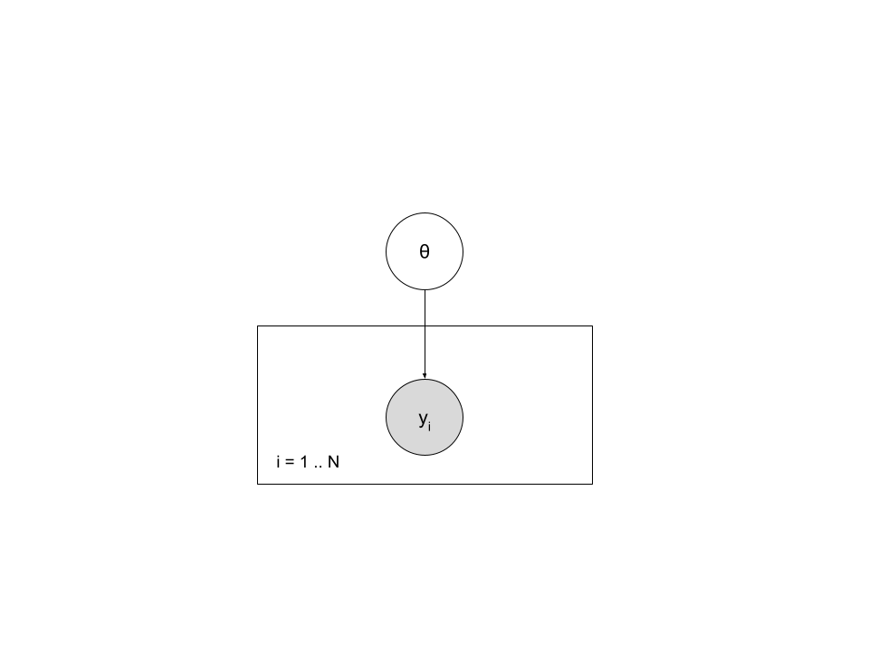

# Schistosomes

```{r setup, include=FALSE}
knitr::opts_chunk$set(echo = TRUE)
```

```{r}
data_eggs <- read.table("schisto.txt", header = T, sep = ",")
hist(data_eggs$y, xlab = "Nombre d'oeufs", col = "yellow3", main = "")
```

```{r}
summary(data_eggs$y)
```

```{r}
sd(data_eggs$y)
```

# Modèle de Poisson



-   $y_i \sim Poisson(\theta)$
-   $\theta \sim Gamma(\alpha, \lambda)$

## Formalisation

```{r}
library(rjags)

desc_model <-
  "
  model {
  
  for (i in 1:N) {
    y[i] ~ dpois(theta)  
  }
  theta ~ dgamma(alpha, lambda)
}
"
```

## MCMC Simulation

### Data

```{r}
data_jags <- list(
  y = data_eggs$y,
  N = length(data_eggs$y),
  alpha = 12,
  lambda = 2
)
```

### Initial values

Start values need to be in the fixed interval of prior distribution:

```{r}
init <- list(
  list(theta = 3),
  list(theta = 6),
  list(theta = 9))
```

### Simulations of Markov chains

```{r}
model <- jags.model(file=textConnection(desc_model),
                data = data_jags,
                inits = init,
                n.chains = 3
                )

update(model, 3000) # burn-in phase
mcmc1 <- coda.samples(model, c("theta"), n.iter = 5000)
```

### Minimal check of convergence

```{r include=FALSE}
mcmc1[1]
```

```{r}
plot(mcmc1)

require(lattice)
xyplot(mcmc1)

```

```{r}
summary(mcmc1)
```

```{r}
gelman.diag(mcmc1) # return only values of 1 for adequate convergence 
gelman.plot(mcmc1)
```

```{r}
cumuplot(mcmc1)
```

### Autocorrelation plot

```{r}
acfplot(mcmc1)
autocorr.plot(mcmc1)

effectiveSize(mcmc1) # estimation of effective size in function of autocorrelation for the 3 chains (3 x 5000 = 15000 iterations)

# if we want reduce as possible autocorrelation, we can set the parameter thin = 15000/7000 (7000 => effective size)

raftery.diag(mcmc1)
# if the dependance factor is grater than 5, it means that a strong autocorrelation is present in the chains
```

### Comparaison between *prior* and *posterior* laws

#### Simulations without observed data (Monte Carlo)

```{r}
d0 <- list(
  N = length(data_eggs$y),
  alpha = 12,
  lambda = 2
)
model0 <- jags.model(file = textConnection(desc_model), data = d0, n.chains = 1)

update(model0, 5000)
mcmc0 <- coda.samples(model0, c("theta"), n.iter = 5000)
mcmctot0 <- as.data.frame(as.matrix(mcmc0))
mctot <- as.data.frame(as.matrix(mcmc1))

# par(mfrow = c(1, 3))
# par(mar = c(5, 2, 1, 1))
# for (i in 1:ncol(mcmctot0))
# {
hist(mctot$theta, main = "", xlab = names(mcmctot0), freq = FALSE)
lines(density(mcmctot0$theta), col = "blue", lwd = 2)
# }
```

```{r}
summary(mcmc0)
```

Rien que en regardant l'intervalle de credibilite a priori [3.13; 9.77] sur le *mcmc0* (sans les données) on remarque que il est beaucoup plus large que l'intervalle à posteriori [2.72; 2.94]. Cela veut dire qu'on a effectivement gagné de l'information.

## Posterior check

```{r}
theta <- mctot$theta
sd_sim <- sqrt(theta)
sd <- sd(data_eggs$y)
hist(sd_sim, xlim = c(1,6))
abline(v =sd, col = "red")
summary(sd_sim)
mean(sd_sim)
sd
```

Depuis cet histogramme on voit clairement que le modèle n'arrive pas à bien estimer la sur-dispersion des données.

```{r}
# freq <- (table(factor(nb_oeufs, levels = 0:60)))
```

# Modèle binomial négatif

L'espérance de ce modèle pour une observation $i$ est $ν_i \times \theta$, où $ν_i$ est un paramètre positif estimé par le modèle qui autorise l'observation $i$
à s'écarter plus ou moins de l'espérance générale $\theta$. Il est considéré que les valeurs de $ν_i$ sur l'ensemble des observations
suivent une loi `Gamma` de paramètres $shape = 1/α$ et $rate = 1/α$. Le modèle est donc défini par:

<center>\$y_i \\sim Poisson(v_i \\times \\theta)\$ \\hspace{2cm} \$v_i \\sim Gamma(1/\\alpha, 1/\\alpha)\$</center>\

La loi `Gamma` de paramètres $shape = 1/α$ et $rate = 1/α$ a une espérance de 1 et une variance de $α$. Ainsi, sur l'ensemble des patients, les nombres d'œufs varieront bien autour de $θ$, et l'ampleur de la dispersion autour de $θ$ sera fonction de la valeur de $α$.

Il sera supposé que $α$ suit *a priori* une loi `uniforme` comprise entre 0 et 10. L'*a priori* du premier modèle sera conservé pour le paramètre $\theta$.
